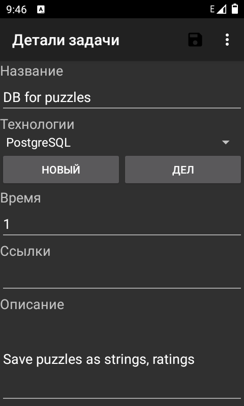

Приложение по выбору хобби проекта для программиста. 

На главной странице находится топ, подсказывающий каким проектом/приложением можно заняться сегодня вечером (в свободное время), т.е. это рейтинг идей, в котором каждую идею/проект можно переместить вверх или вниз, чтобы вывести вверх наиболее интересный проект.

Каждый проект состоит из
- ссылок
- текста
- оценки сложности (вреия до первого прототипа, установка окружения)
- используемые технологии

Список технологий можно пополнять и ранжировать по крутости. Вес технологии на место проекта в топе.

Я обычно собираю инфу на компе во время прокрастинирования или на работе. В этот момент мне нужно скопировать информацию из браузера в Pet Project Navigator (сайт или десктопное приложение). Затем в удобное время когда я не нахожусь за компом, а под рукой только телефон, я могу отсортировать собранную информацию.

Каждая задача содержит время на выполнение. Если задача состоит из ссылки на статью, которую надо прочитать, то желательно, чтобы приложение само оценило время необходимое на прочтение. Если это какие-то типовые задачи по установке языка программирования, сред разработки, утилит и приложений, то на это нужно создать базу данных от других пользователей. Пользователь может приступить к выполнению задачи, что начнет отсчет времени. По завершении задачи приложение автоматически регистрирует затраченное время. Проект будет отображать общее на все задачи время запланированное и реально потраченное.

