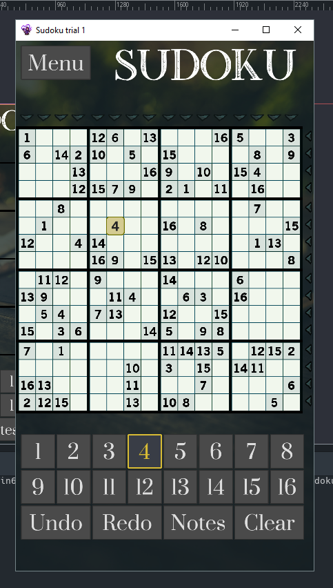

## Как у меня провалилась оценка сроков

В своё свободное время я стараюсь развивать себя. Как программиста - смотреть новые технологии, повторять или изучать новые алгоритмы, решать простые задачки на codewars.

И вот одним вечером моя вторая половина заявляет, что на Play Store нет нормального судоку размером 16х16. Я говорю, что если найти любой проект на github под android, то сделать его под желаемые требования не займёт больше двух вечеров.

Надо сказать, что с тех пор прошло месяца три.

Немного времени я отвел на то, чтобы пробежаться по общим сведениям из [википедии](https://en.wikipedia.org/wiki/Sudoku), [статьям в СМИ](https://www.theguardian.com/media/2005/may/15/pressandpublishing.usnews) и [теоретическим](https://www.sudokuwiki.org/Getting_Started) [фанатским](https://www.sudoku-puzzles-online.com/hexadoku/enter-a-solution-hexadoku.php) сайтам. Нужно было ответить для себя на вопросы: как там задействован [Эйлер](https://projecteuler.net/problem=96), по какому принципу [генерируются пазлы](http://davidbau.com/archives/2006/09/04/sudoku_generator.html) и какие [математические разделы](https://arxiv.org/abs/1304.1628) стоит повторить перед тем как углубляться в этот проект.

## Судоку на Реакте для Андроида

Достаточно быстро на гитхабе я наткнулся на [приличный судоку](https://github.com/nihgwu/react-native-sudoku) написанный на react-native. Технология для меня неизвестная, в ридми на гитхабе гифка мне нравится - значит берём и ставим. Покрутил, посмотрел - точно нравится. После рефакторинга (убрал магические числа, задающие размер паззла - 81, 27, 9 3) увеличил множитель с 3 на 4.

И все сломалось. 

Иногда красный экран и непонятный traceback. Иногда приложение не стартует. Непонятно как этот ваш реакт отлаживать.

Забегая вперёд скажу, что алгоритм генерация поля для 16х16 вешается на неопределенно долгое время. Возможно, что там бесконечный цикл получается из-за того, что алгоритм продуман только для 9х9 версии. Для 9х9 поля алгоритм выдаёт результат за секунду. Надо пересматривать алгоритм, а вникать в него желания нет. ([Посмотрите](https://github.com/nihgwu/react-native-sudoku/blob/master/app/utils/sudoku.js#L124) сами)

## Судоку на Реакте для браузера

Написать некоторое подобие судоку на react для web получилось прямо за реактивные сроки.

... не могу найти исходники 😭

## Правильный генератор

И вот здесь здравый смысл в планировании нерезинового вечернего времени затерялся [где-то](https://www.youtube.com/watch?v=QR66rMS_ZfA) за планом о создании тулзы, которая будет [пошагово решать](http://sudopedia.enjoysudoku.com/Cross-Hatching.html) судоку и графически [объяснять каждый ход](http://sudopedia.enjoysudoku.com/Sudoku_Explainer.html). Благо [такая тулза](https://github.com/SudokuMonster/SukakuExplainer) быстро [нашлась](https://sourceforge.net/projects/sudoku-sensei/) на [java](/blog/why-do-i-hate-java). Правда я долго тупил, как её запустить в IntelliJ Idea.

## Сервер на Кложуре

Здесь пока и конь не валялся

- https://github.com/heroku/clojure-getting-started/blob/master/project.clj
- https://leiningen.org/
- https://www.clojure-toolbox.com/

## Как уместить 16х16 пазл на мобильный экран?

