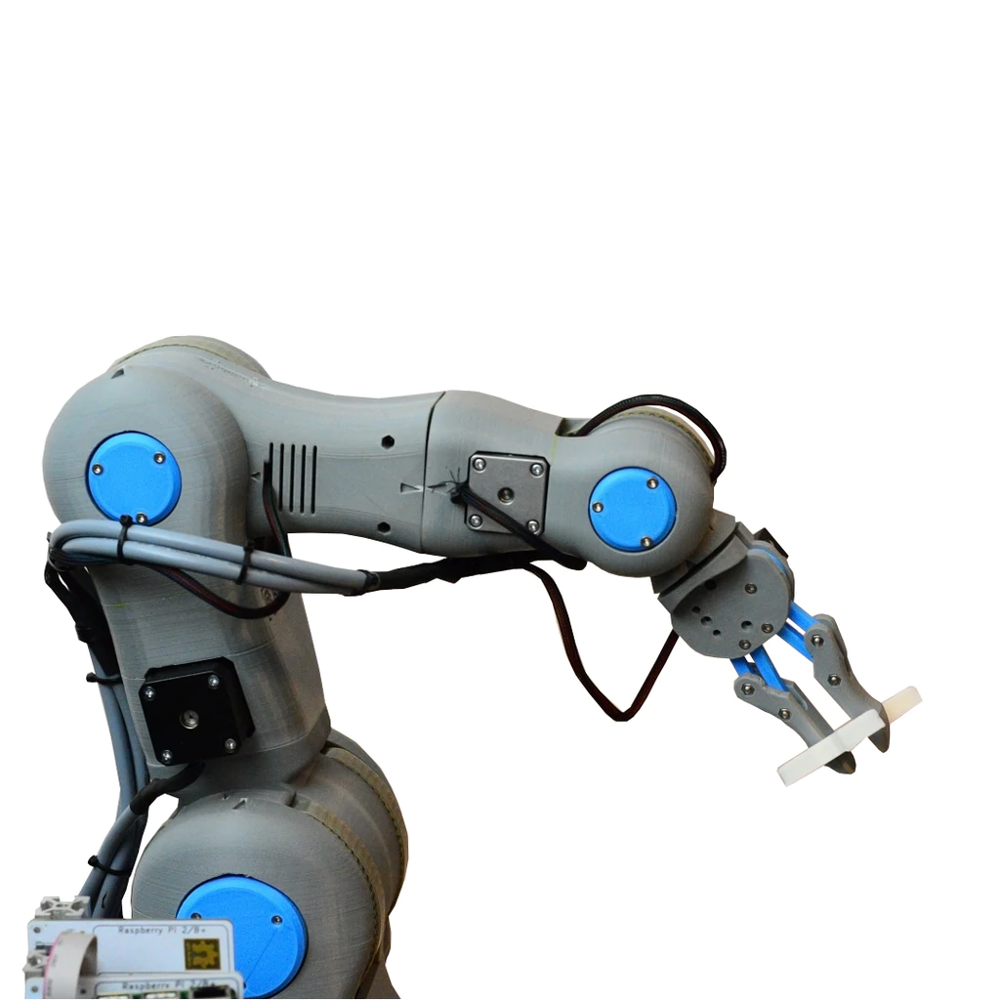

Купил 5 серво-моторов и долго пытался понять как сделать функционального робота только из 5 моторов, тогда как на одну конечность минимум нужно 2, а то и 4 в зависимости от желаемой подвижности. Если даже остановиться на 2 для каждой ноги, то на трех ногого не хватает. Т.е. как из этого сделать подвижного робота на ногах и без колес? Начал моделировать объекты в Блендере чтобы потом вставить их в игровой движок с физикой и запустить машинное обучение, которое научится двигать моторы, чтобы перемещаться.

## Что уже кто сделал

**Дельное замечание**: на нижний мотор приходится большая нагрузка по удержанию всей конструкции. А так простые щупальца, но есть приложения для андроида по управлению через Bluetooth. [Пошаговая инструкция](https://howtomechatronics.com/tutorials/arduino/diy-arduino-robot-arm-with-smartphone-control/).

Красивые корпуса [1](https://library.zortrax.com/project/zortrax-robotic-arm/) и [2](https://roboteurs.com/products/rbx1-remix-3d-printed-6-axis-robot-arm-kit?variant=40314908751).
Найдено в [этой подборке](https://all3dp.com/2/10-best-robot-arms-to-3d-print-or-buy/).

Нужно еще смотреть на характеристику веса, котрый рука может поднять. Я часто вижу лимит в 100 грамм. Это как-то мало.

AR4 https://www.anninrobotics.com/

Hackaday https://hackaday.com/tag/diy-robot-arm/

## Fruit picking robot arm

Начинаю поиск, который бы учитывал, что мне нужна специфичный захват: _Fruit picking robot arm DIY projects_. Под этим я подразумеваю наличие более двух пальцев у манипулятора, что обеспечит распрделеить давление на объект при обеспечении крепкого захвата, способного отрывать плоды от растения. Две клешни сжимающиеся как плоскогубцы не обеспечат таких свойств.

https://www.intorobotics.com/fruit-harvesting-robots/

Можно обойтись без хитростей с пальцами - достаточно иметь трубу способную затягивать предметы с помощью вакуума

Abundant Robotics Apple Harvesting Robot https://www.youtube.com/watch?v=7rNpbyW9kws

Raspberry picking https://www.theguardian.com/technology/2019/may/26/world-first-fruit-picking-robot-set-to-work-artificial-intelligence-farming