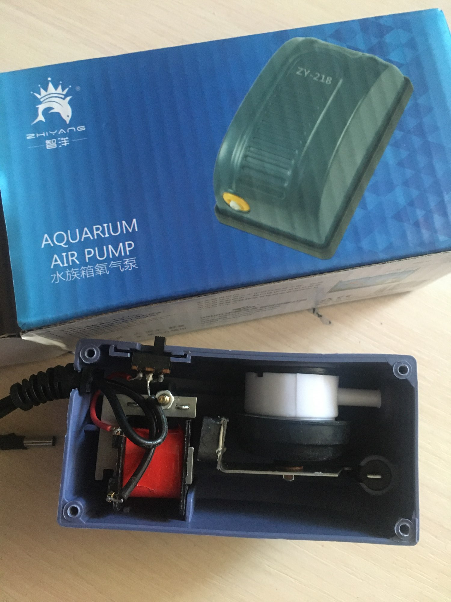
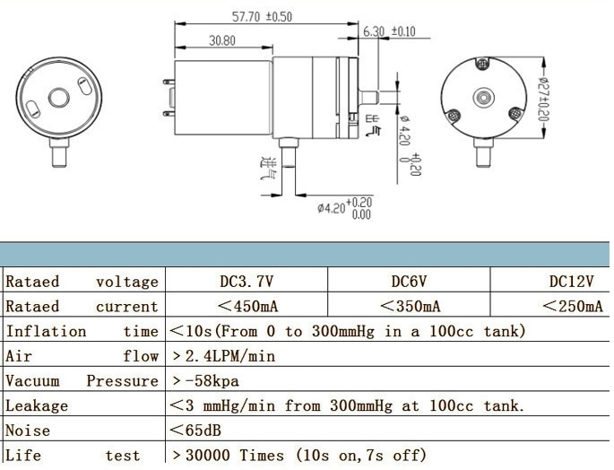
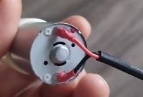

Вот как выглядит насос внутри корпуса

В этой коробке есть преобразователь напряжения из розетки и лишний пластик, а так как мы в любом слчае будем питать от своего блока питания и будет крепить насос в свой корпус, то будем покупать сразу минимальную версию: насос сделай сам

Характеристики

Положительный провод идет на клемму помеченную красным. Хотя я пробовал подключать в обратном направлени: моторчик все равно работает и дует в том же направлении.
