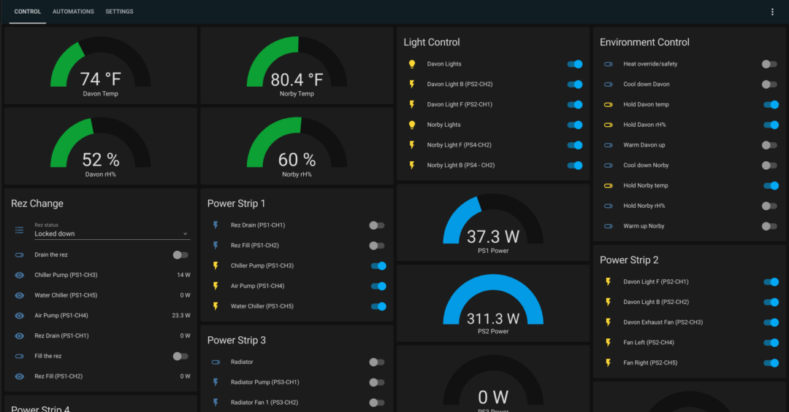
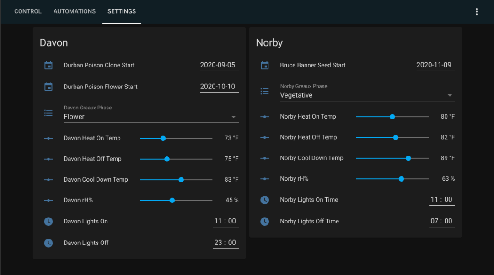
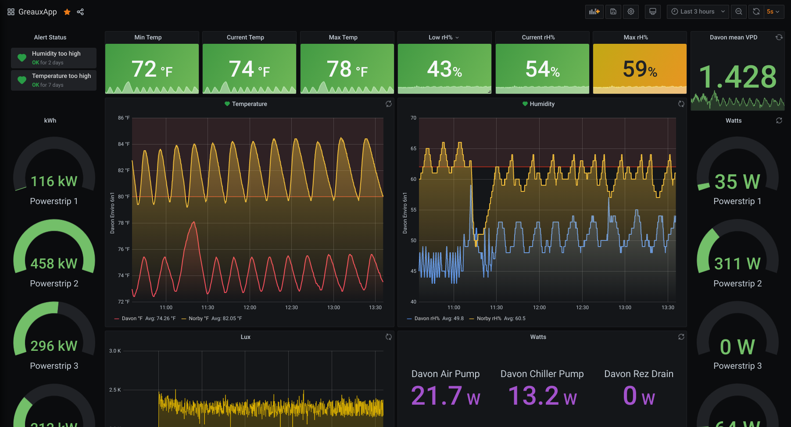

Перильстатические насосы смешивают питательный раствор и контролируют кислотность, сверяясь с показаниями датчиков.

Это если коротко.

[Как сделать экран красивым?](/ru/make/hydroponics/dashboard-ui)