Что сейчас имеется в продаже в интернет магазинах по всему миру https://dacharu.ru/tovary-dlya-doma/vertikalnoe-ozelenenie/intellektualnaya-plantaciya-na-12-mest

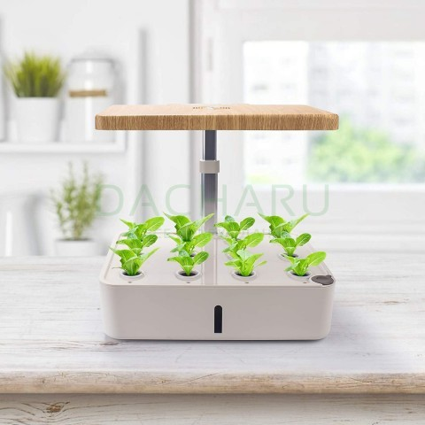

Конечно, во всех статьях по гидропонике мы видим белые трубы. Я подозреваю ПВХ.

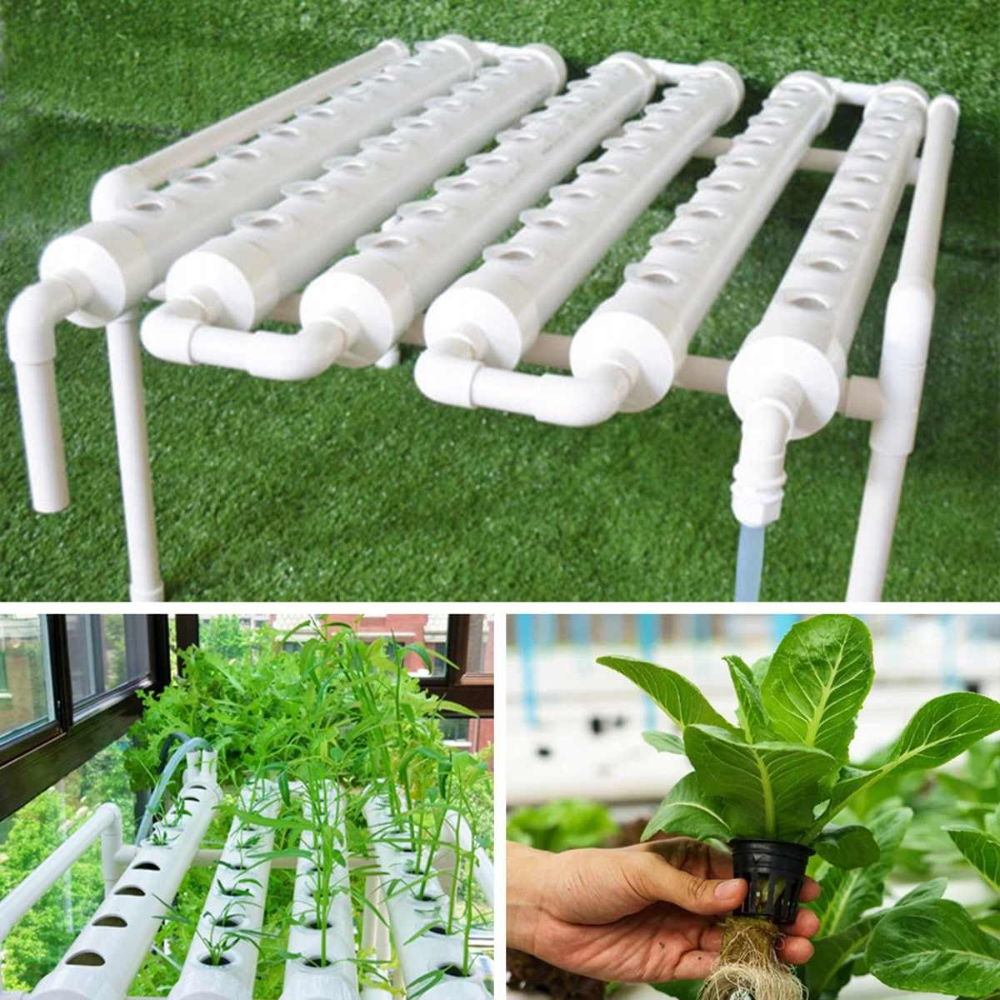
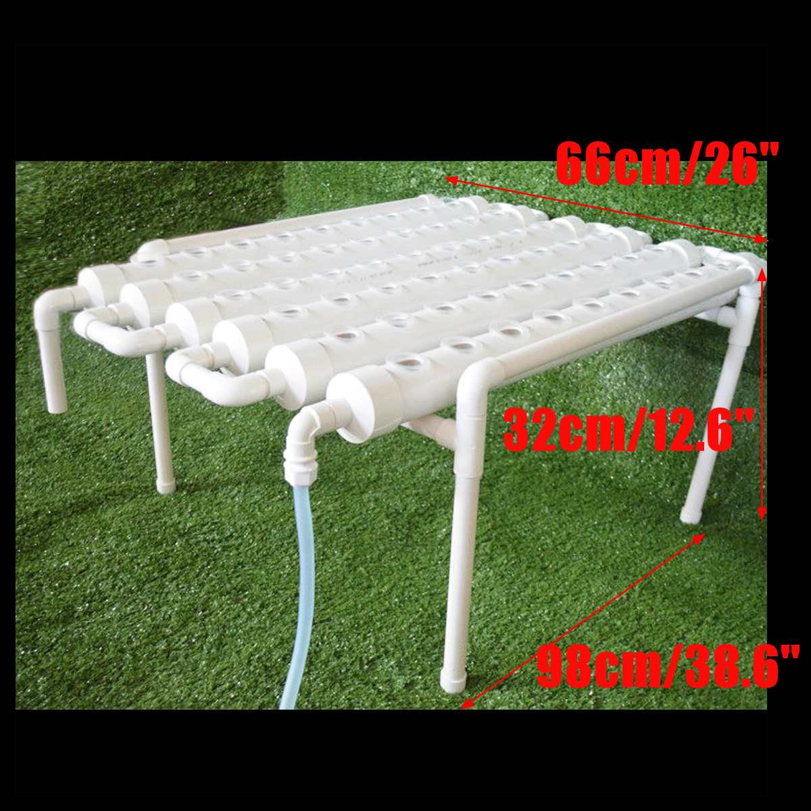
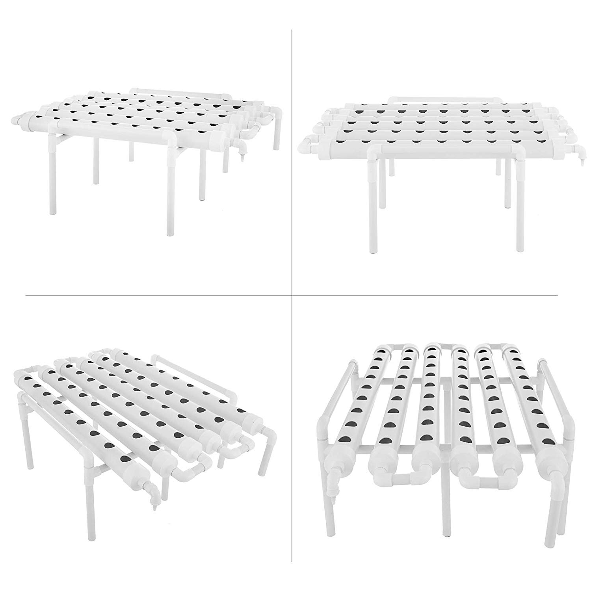
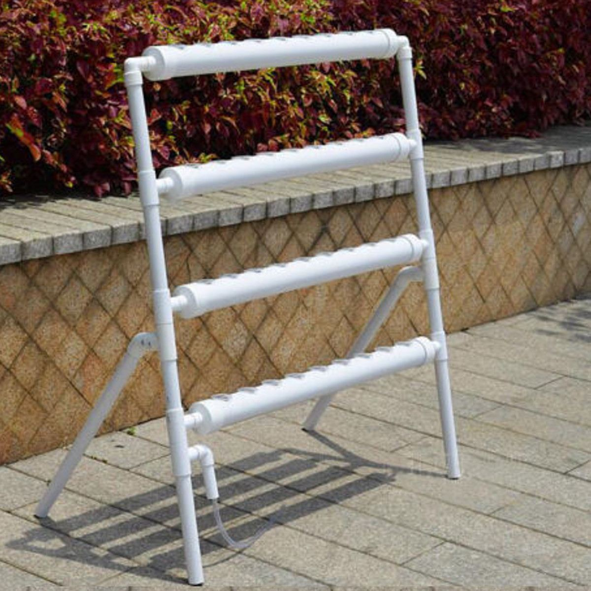
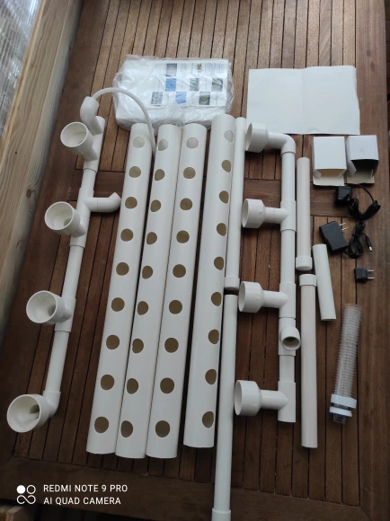

Но я вижу каркас как стеллаж, то есть простая алюминиевая рама  - дешевый и прочный вариант.

При серийном производстве нужно будет исключить раму как отдельный компонент и совместить ее с емкостью для воды

Таким образом корпус можно весь сделать из ПВХ, а этот материал поддается [фрезеровке на ЧПУ](http://www.zenit-nsk.ru/frezernye-raboty/frezerovka-pvh-na-chpu.php) и [сварке термопластов](https://www.sibmashpolymer.ru/ab-proizv/). (Вот еще [коллекция поделок](https://www.farpost.ru/novosibirsk/service/furniture/izgotovlenie-mebeli-i-prochego-iz-pvh-truby-47805342.html) из ПВХ труб

Вот примеры конструкций напечатанных на 3Д принтере

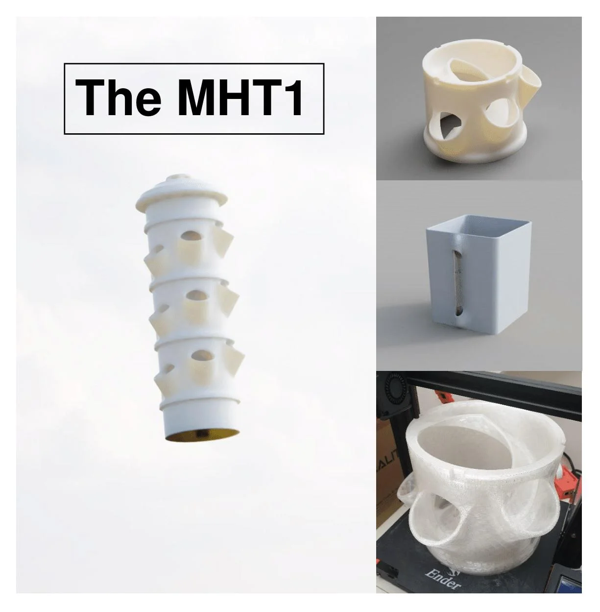
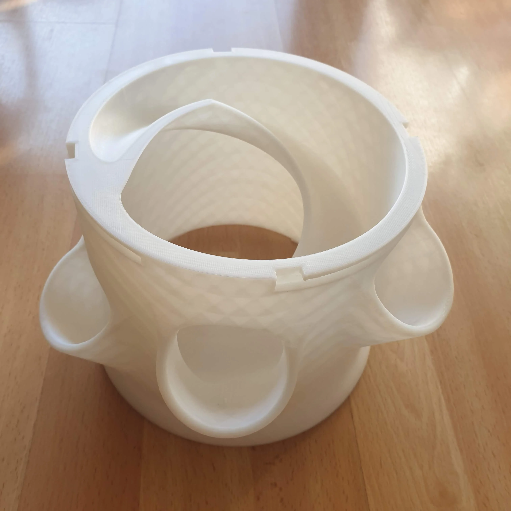
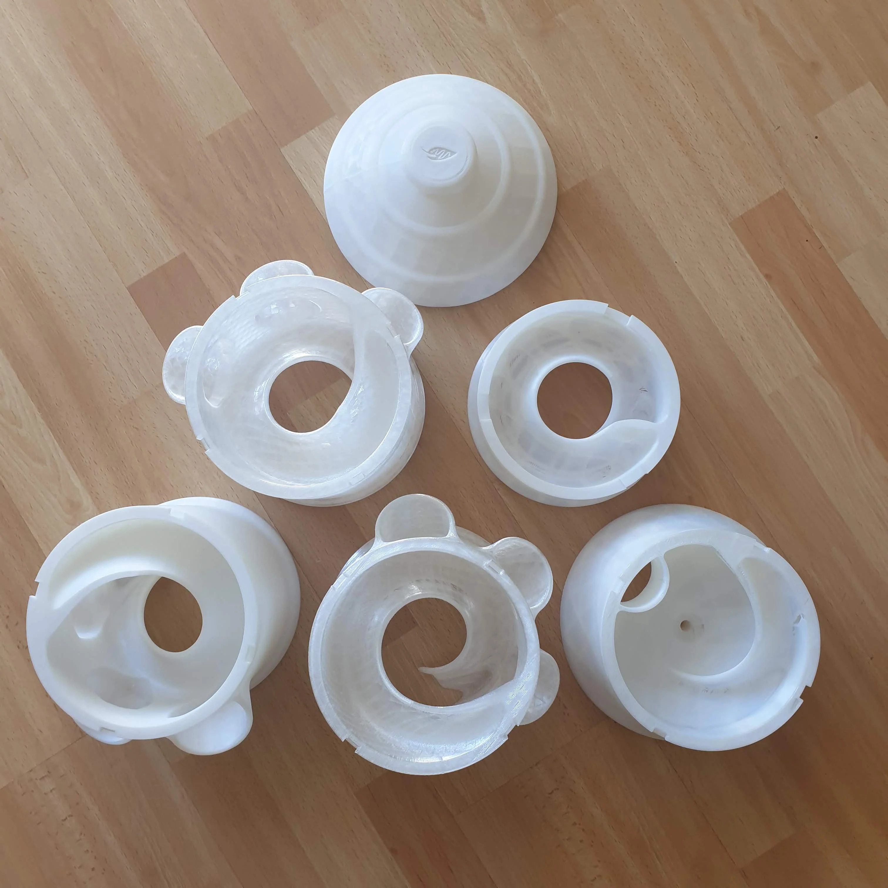
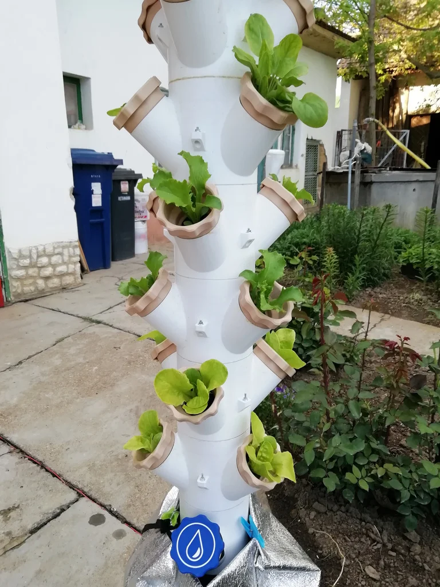
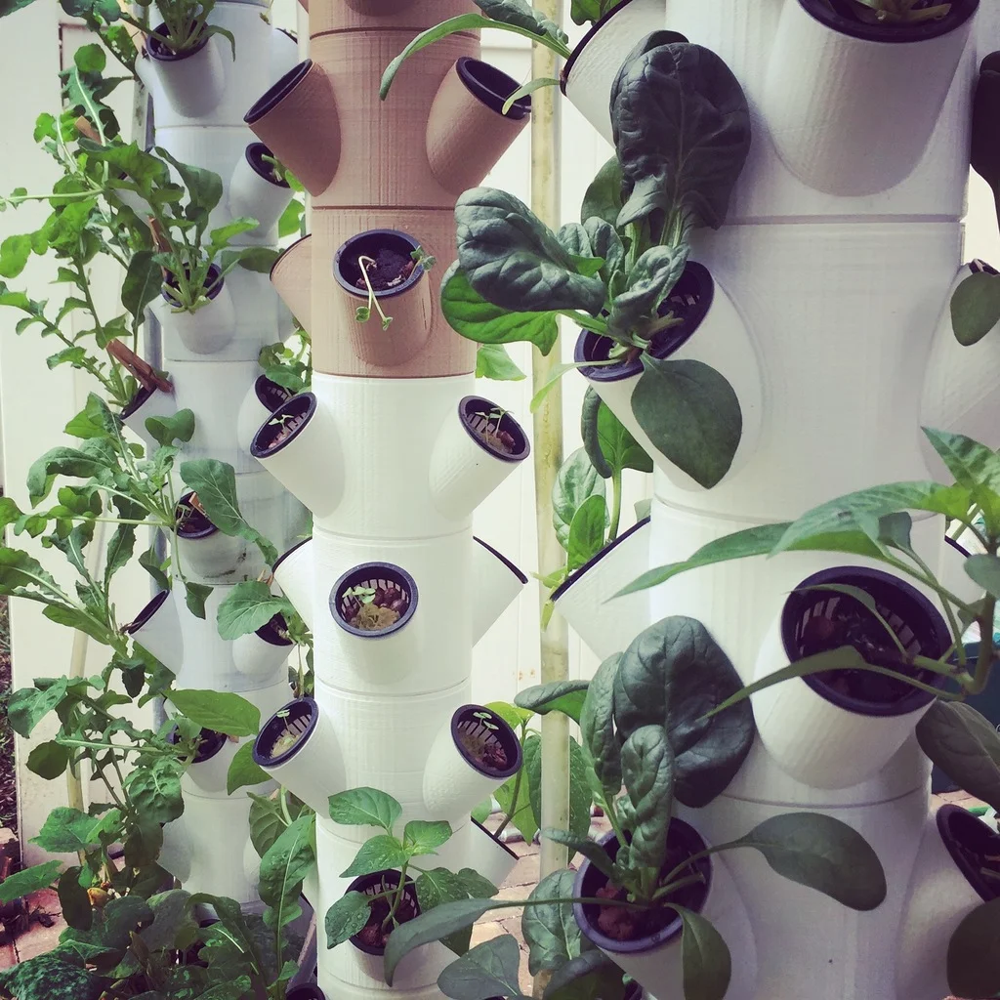
