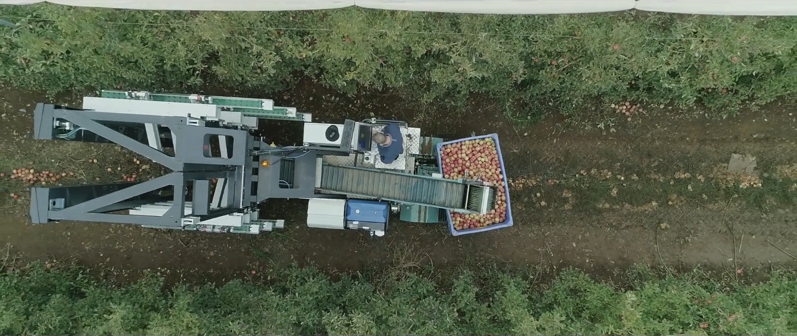
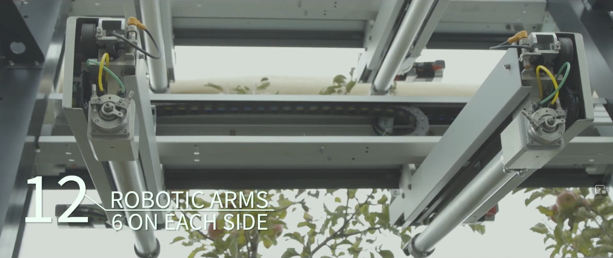
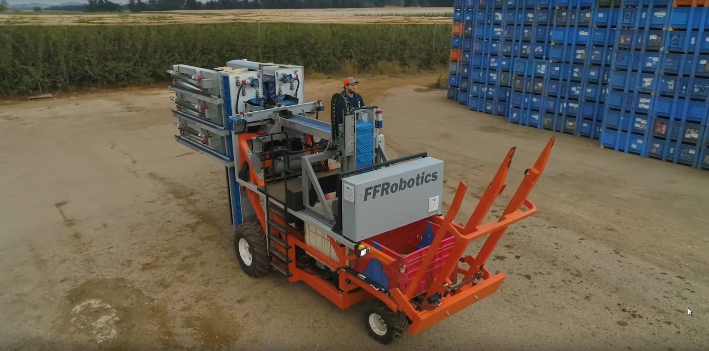
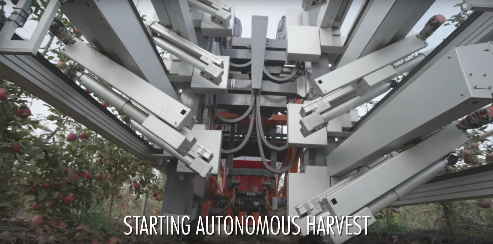
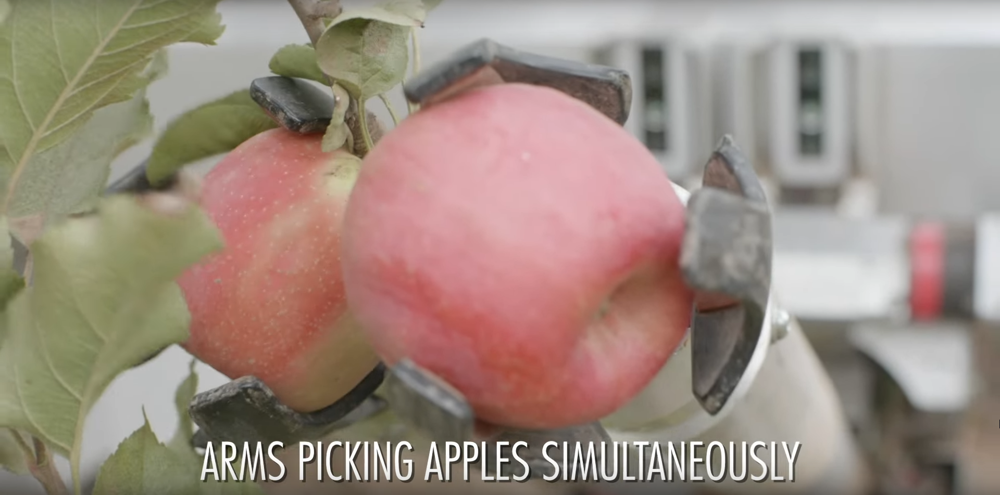
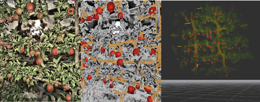
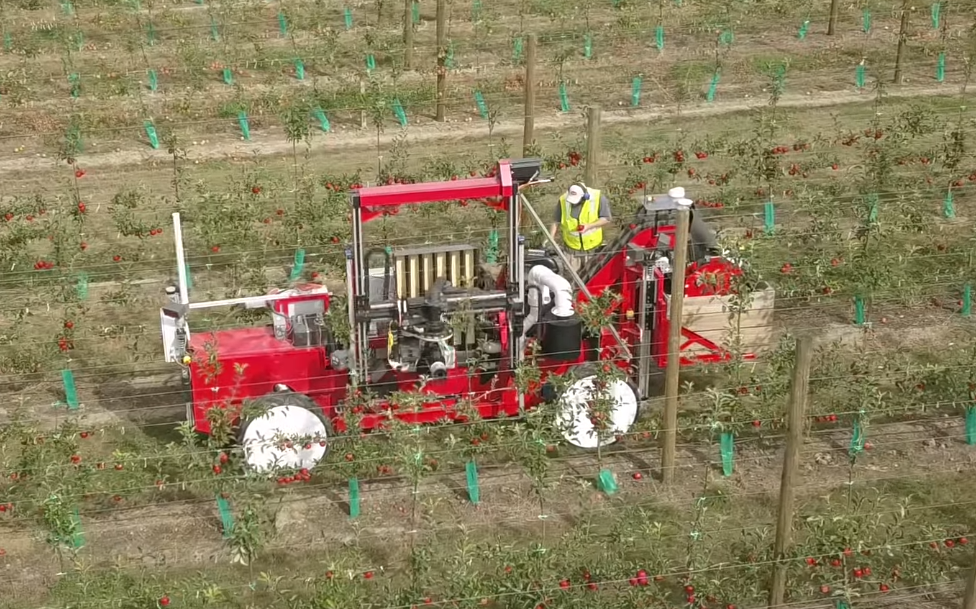

## Роботы-трудяги в поле

### Пф-пф-роботикс

Компания **Fresh Fruit Robotics**, которая чаще пишется как [FFRobotics](https://www.ffrobotics.com/), сделала робота с множеством рук, которые движутся вверх-вниз для позиционирования на цели, а также вперед-назад, чтобы компенсировать место робота по отношению к цели и иметь возможность одновременного захвата несколькими манипуляторами с одной позиции.

На своем сайте они пишут, что робот окупится и избавит вас (или ваших крестьян) от синяков.

- 2018 https://www.youtube.com/watch?v=rpPHR-mZEOQ
- 2021 https://www.youtube.com/watch?v=kLmersqggOY

### Обильные роботы

Если следующий стартап не будет использовать в своем названии слово "роботикс", то она не получит инвестирование. Встречайте, [Abundant Robotics](https://abundantrobotics.com/). Для срывания яблок используют трубу с вакуумом внутри.

Интересная инфографика у них, вот сухие цифры:

- 60% цены яблока - это оплата труда и из них 44% это затраты только на выращивание
- зарплаты сельхозработников выросли на 70% на последние 5 лет (данные не уточняются, но я думаю, что это только для США)

- https://www.youtube.com/watch?v=KBgyEgF4f9U

## 3D печатные проекты

Водопадная система (очень шумная, поэтому есть вариант по типу [проточной тонкослойной подачи (nutrient film technique)](/ru/make/hydroponics/nutrient-film-technique) https://www.reddit.com/r/hydro/comments/laa76h/i_wanted_to_share_a_project_of_mine_an_opensource/)

- [Модульные башни](https://www.thingiverse.com/thing:3405964) Немного видео https://www.youtube.com/channel/UCL1WZQKbyrSAYk2y8n7KtSg?view_as=subscriber
- [Улучшенная(?) версия](https://www.thingiverse.com/thing:3405964)

## Системы капельного орошения

- https://leplants.ru/tsvetovodstvo/sistemy-kapelnogo-orosheniya-v-gidroponike-drip-systems/
- https://www.growertoday.com/top-feed-drip-system-hydroponics/
