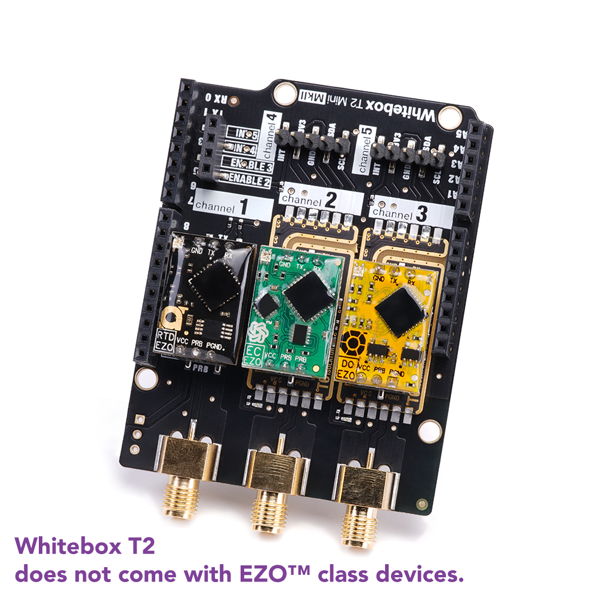

## Более подробные статьи

- [PH кислотность воды](/ru/make/hydroponics/sensors/ph)
- [CO2 углекислый газ](/ru/make/hydroponics/sensors/co2)
- [Давление](/ru/make/hydroponics/sensors/temperature)
- [Влажность](/ru/make/hydroponics/sensors/humidity)
- [Температура](/ru/make/hydroponics/sensors/temperature)
- [Датчик солей](/ru/make/hydroponics/sensors/tds)

----

[OpenHydro](https://github.com/Cribstone/OpenHydro) - подробный список сенсоров для Ардуинки (не проверял).

## Качество воды (TDS)

- https://aliexpress.ru/item/4001010691199.html
- https://aliexpress.ru/item/33050818416.html

## Температура / влажность / давление

**TE Connectivity (Tyco) MS8607**
- [Зарубежный магаз](https://www.sparkfun.com/products/16298)
- [Купить](https://www.chipdip.ru/product/ms860702ba01-50)
- [Datasheet](http://www.farnell.com/datasheets/2301874.pdf)

Вот как панель датчиков может выглядеть: https://atlas-scientific.com/electrical-isolation/whitebox-t2/

