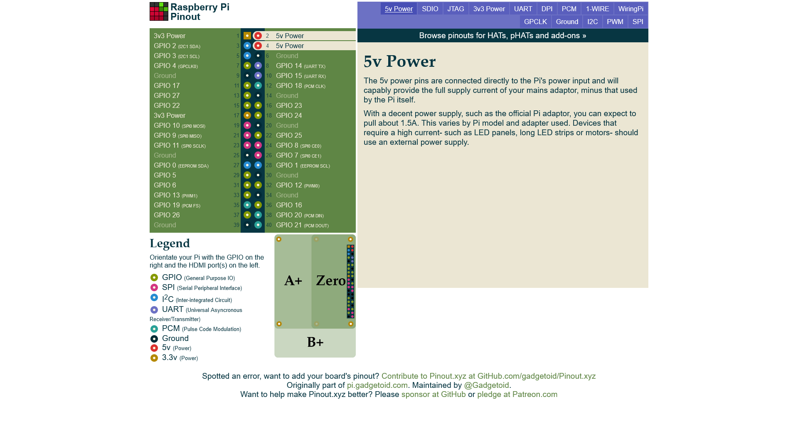

С одной стороны найти дешевый датчик углекислого газа сложно, потому что тема климата и окружающей среды для DIY еще не поставлена на поток, рынок в основном предлагает датчики угарного газа, дыма, алкоголя и другого. С другой стороны всяких разнообразных решений по детектированию углекислого газа намного больше чем датчиков [кислотности воды](/ru/make/hydroponics/sensors/ph) или [температуры](/ru/make/hydroponics/sensors/temperature):

- [SCD30 Sensirion](https://www.sensirion.com/en/environmental-sensors/carbon-dioxide-sensors/carbon-dioxide-sensors-scd30/)
- [AMS IAQ-CORE C](https://www.compel.ru/item-pdf/c232e7e7dbddb20824a26cdc0f748bed/pn/ams~iaq-core-c.pdf)
- [Sense Air](https://senseair.com/products/size-counts/s8-residential/)
- Figaro TGS4160
- WINSEN MG811, WINSEN MG812
- CCS811B

Именно последний из них (CCS811B) показался мне интересным по конструкции и по цене. 

Купил я его на али [от keyestudio](https://s.click.aliexpress.com/e/_AmOv9C).
Есть [другой вариант](https://s.click.aliexpress.com/e/_An8OwQ), который сразу на плате имеет датчик температуры и влажности.

[Даташит](https://cdn.compacttool.ru/downloads/CCS811_Datasheet.pdf)


## Абракадабра от продавца

Описание с [официального сайта](https://wiki.keyestudio.com/KS0457_keyestudio_CCS811_Carbon_Dioxide_Air_Quality_Sensor)

<blockquote>

Keyestudio CCS811 carbon dioxide, temperature air quality sensor mainly uses the CCS811B chip. It is an ultra-low-power miniature digital gas sensor that can detect a wide range of volatile organic compounds (TVOCs), including equivalent carbon dioxide (eCO2) and metal oxide (MOX) levels.

Equivalent carbon dioxide (eCO2) is measured in the range of 400 to 8192 ppm (parts per million), and various volatile organic compounds (TVOC) ranges from 0 to 1187 ppb (parts per billion).

At the same time, the sensor comes with a 10K precision 1% NTC thermistor, which can be used to test the specific temperature in the environment.

In order to fix to other devices, the sensor comes with a positioning hole with a diameter of 3mm.

Technical Parameters

- Working voltage: DC 5V
- Working current: 30mA
- Maximum power: 46mW
- eCO2 measurement range: 400-8192 ppm
- TVOC measurement range: 0 to 1187 ppb
- Working temperature: -25 ~ +65℃
- Interface: 7pin (2.54mm pitch)
- Positioning hole diameter: 3mm  
- Dimensions: 30*20mm
- Environmental attributes: ROHS
 
</blockquote>

### Комменты

> There was almost 3 days burn-in period before the sensor stopped drifting. Now it seems to read the value well, although I have no way of testing its precision. It also requires 20 minutes of preheat when cold started and baseline calibration.

Я так понял, что нельзя, чтобы датчик лежал долго без использования.

> The sensors resistance will drift reversibly if it’s stored for a long time without electrify, this drift is related with storage conditions. Sensors should be stored in airproof bag without volatile silicon compound. For the sensors with long time storage but no electrify, they need to belong galvanized aging time for stability before using. 


## Подключение

### PINOUTS

- GND - ground
- VCC - Input power（5V）
- SDA - I2C data pin
- SCL - I2C clock pin
- RST - Reset pin: connect to ground, sensor will automatically reset.
- WAKE - WAKE pin should connect to ground to communicate with sensor conveniently
- INT - This is the interrupt output pin that detects when a new reading is ready or the reading becomes too high or too low. 

### Подключение к Малинке

**VCC, Питание.** 5 вольт можно взять с пинов 2 и 4 на малинке.



Заметка: использую сайт https://pinout.xyz/pinout/5v_power, который показывает распиновку и подсказки по каждому пину.

Но вот вопрос, а нужно ли подавать 5 вольт? Ведь по даташиту основной чип может принять максимум 3,3 вольта. Протокол общение с хостом - это I2C. Протокол может работать на любом напряжении, но оно должно быть одинаковым у всех устройств. 

Плата рассчитана для подключения к Ардуино и только поэтому в спецификации указано 5V. Давайте взглянем на платку внимательно и изучим первый компонент, который встречается нам по линии VCC. После конденсатора это будет стабилизатор напряжения промаркированный как LPFG, который соответствует модели [LP2985](https://www.ti.com/lit/ds/symlink/lp2985a.pdf) для 3,3 вольта.


Подтягивающие резисторы присутствуют как в Малинке так и на платке сенсора. Значит SDA между платкой и контроллером соединяем вместе. SCL соединяем с SCL тоже. WAKE идет на общий, чтобы активировать платку.

## Скрипт для Малинки

Допустим, что на Малинке уже [стоит система](/ru/make/raspberry-pi-setup). Вот скрипт для Малинки на Питоне

```python

```

## Подключение к Ардуино

## Скетч для Ардуино

```c
#include <CCS811.h>

/*
 * IIC address default 0x5A, the address becomes 0x5B if the ADDR_SEL is soldered.
 */
//CCS811 sensor(&Wire, /*IIC_ADDRESS=*/0x5A);
CCS811 sensor;

void setup(void)
{
    Serial.begin(115200);
    /*Wait for the chip to be initialized completely, and then exit*/
    while(sensor.begin() != 0){
        Serial.println("failed to init chip, please check if the chip connection is fine");
        delay(1000);
    }
    /**
     * @brief Set measurement cycle
     * @param cycle:in typedef enum{
     *                  eClosed,      //Idle (Measurements are disabled in this mode)
     *                  eCycle_1s,    //Constant power mode, IAQ measurement every second
     *                  eCycle_10s,   //Pulse heating mode IAQ measurement every 10 seconds
     *                  eCycle_60s,   //Low power pulse heating mode IAQ measurement every 60 seconds
     *                  eCycle_250ms  //Constant power mode, sensor measurement every 250ms
     *                  }eCycle_t;
     */
    sensor.setMeasCycle(sensor.eCycle_250ms);
}
void loop() {
  delay(1000);
    if(sensor.checkDataReady() == true){
        Serial.print("CO2: ");
        Serial.print(sensor.getCO2PPM());
        Serial.print("ppm, TVOC: ");
        Serial.print(sensor.getTVOCPPB());
        Serial.println("ppb");
        
    } else {
        Serial.println("Data is not ready!");
    }
    /*!
     * @brief Set baseline
     * @param get from getBaseline.ino
     */
    sensor.writeBaseLine(0x847B);
    //delay cannot be less than measurement cycle
    //delay(1000);
}
```

## Ссылки

- [Али](https://s.click.aliexpress.com/e/_AmOv9C)
- [Даташит](https://cdn.compacttool.ru/downloads/CCS811_Datasheet.pdf)


## Другие варианты

**SCD30 Sensirion**
- [Сайт производителя](https://www.sensirion.com/en/environmental-sensors/carbon-dioxide-sensors/carbon-dioxide-sensors-scd30/)
- [Купить на али](https://aliexpress.ru/item/1005001392172293.html)

**AMS IAQ-CORE C**
- [Datasheet](https://www.compel.ru/item-pdf/c232e7e7dbddb20824a26cdc0f748bed/pn/ams~iaq-core-c.pdf)
- [Купить на али](https://aliexpress.ru/item/33044332335.html)

**Sense Air**
- [Сайт производителя](https://senseair.com/products/size-counts/s8-residential/)
- [Купить на али](https://aliexpress.ru/item/32863793412.html)

**Figaro TGS4160**

**WINSEN MG812**
- [Datasheet](https://www.winsen-sensor.com/d/files/PDF/Solid%20Electrolyte%20CO2%20Sensor/MG812%20CO2%20Manual%20V1.1.pdf)
- [Купить](https://www.chipdip.ru/product0/8000978122)

**WINSEN MG811**
- [Купить на али](https://aliexpress.ru/item/1005002212335911.html)
