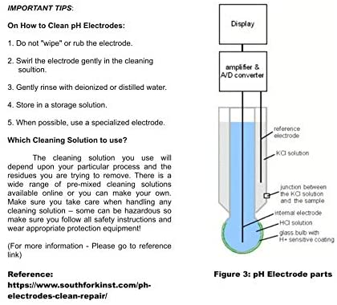
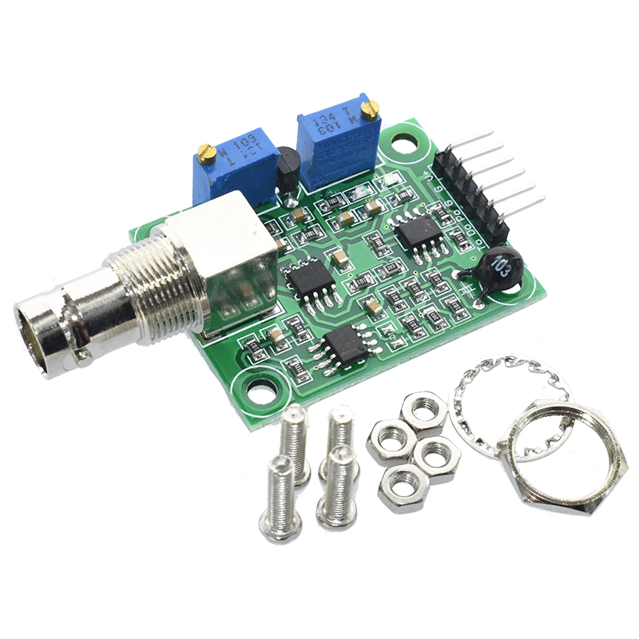
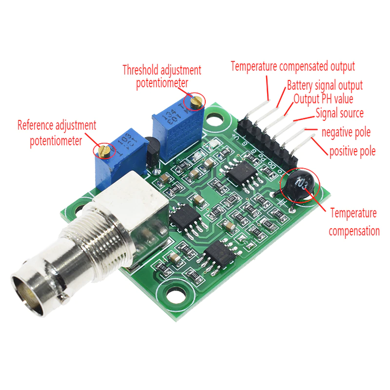

Зондов по измерению кислотности воды на Али Экспресс очень много. Я рассматривал много вариантов и остановился на [одном](https://s.click.aliexpress.com/e/_9Rk02I) от магазина Kmust

### Подключение

Покдключать будем к плате [Wemos D1](/ru/make/wemos-d1), которую я импульсивно купил в местном магазине. 
Подключение такое же как и к любой другой Arduino-совместимой плате:

- GND - GND, земля к земле (на плате разведены раздельно, но подключаем их к плате к любому пину GND, которые суть один контакт)
- аналоговый сигнал P0 в порт для чтения аналогового сигнала A0
- на V+ подадим 5 вольт (5V)


**read_voltage.ino**:
```c
#include <Arduino.h>
const int adcPin = A0;

void setup() {
  Serial.begin(115200);
}

void loop() {
  int adcValue = analogRead(adcPin);
  float phVoltage = (float)adcValue * 5.0 / 1024;
  Serial.print("ADC = "); Serial.print(adcValue);
  Serial.print(";  Po  = "); Serial.println(phVoltage, 3);
  delay(1000);
}
```

Нужно крутить подстроечный резистор пока не выдаваемое напряжение не станет равным 2,5В.

Проблем, конечно, тут возникло сразу несколько. 

Во первых, показания на мультиметре и чтения аналогового входа не сошлись. Принято решение не доверять аналоговому входу на дешевой непроверенной китайской плате.

Во вторых, изначальное измерение показало 3,92В и подстроечный резистор пришлось долго крутить против часовой стрелки. Где-то оборотов 50, но я могу точнее посмотреть на видео. Чтобы остановиться точно на 2,5В я решил подкрутить еще немного, спуститься до 2,48-2,49В и найти четкую середину, где бы было 2,50В. Но спустить ниже 2,5В не получалось. Кручу-кручу, а показания все так же остаются на 2,5В. Начинают закрадыаться подозрения, что я что-то делаю не так, сюдя по тому, что я достиг какого-то минимума.

Почему же в туториалах никогда не рассматривают все непредвиденные случаи. Это у меня везение такое, что ли?

В комментах на Али нащел такое замечание:

Все комбинированные электроды необходимо хранить влажными. Обычно используется 0,5—1 M раствор KCl, подкисленный до pH 5-6 (для растворения налета на стекле электрода). Также, после каждого измерения, электрод необходимо промыть в дистиллированной воде. Всё это нужно, чтобы увеличить межкалибровочный интервал.

### Откалибровать

- Хорошая инженерная [статья](https://www.e-tinkers.com/2019/11/measure-ph-with-a-low-cost-arduino-ph-sensor-board/) о дешевых китайских платах
- Предупреждение об отрицательном напряжении [от слудителей Интернету вещей](https://cimpleo.com/blog/simple-arduino-ph-meter/)
- Таблица кислотностей подручных средств [в этом блоге](https://scidle.com/how-to-use-a-ph-sensor-with-arduino/)
- Место где все блоги сходятся в одном месте [Вопрос-ответ на stackexchange](https://raspberrypi.stackexchange.com/questions/96653/ph-4502c-ph-sensor-calibration-and-adc-using-mcp3008-pcf8591-and-ads1115)
- Автор ответа на stackexchange [в своем блоге](https://tlfong01.blog/2019/04/26/ph-4502c-ph-meter-calibration-notes/) публикует **код**
- И еще [код](https://wiki.dfrobot.com/PH_meter_SKU__SEN0161_)


## Ссылки

[Али](https://s.click.aliexpress.com/e/_9Rk02I)
