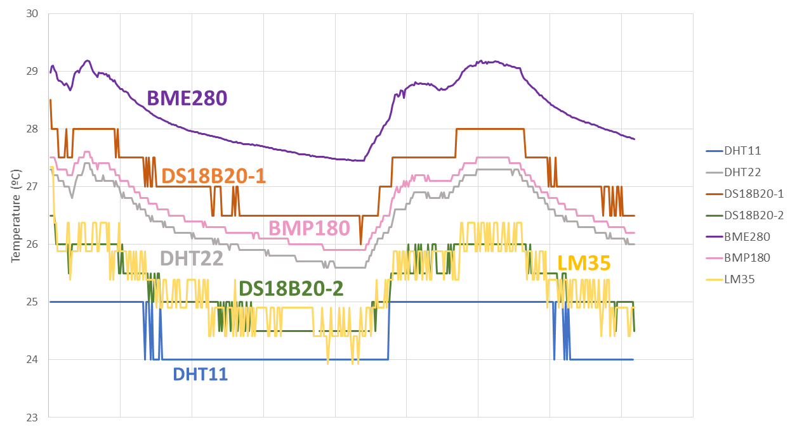

Похоже это самый крутой обзор/сравнение доступных на рынке датчиков температуры: https://randomnerdtutorials.com/dht11-vs-dht22-vs-lm35-vs-ds18b20-vs-bme280-vs-bmp180/
где в наглядном графике показано, какие данные вы будете получать от сенсора.

Из которого следует, что я выбираю **BME280** без каких либо сомнений.

**ASAIR AHT10**
- [Обзор](https://elchupanibrei.livejournal.com/53764.html)
- [Datasheet](https://server4.eca.ir/eshop/AHT10/Aosong_AHT10_en_draft_0c.pdf)
- [Купить](https://www.chipdip.ru/product1/8007154405)
- [Купить на али](https://aliexpress.ru/item/4000125526434.html) (с понижающей до 5В схемой)

**DHT22**
- [Как подключать](https://www.mouser.com/datasheet/2/737/dht-932870.pdf)
- [Datasheet](https://files.seeedstudio.com/wiki/Grove-Temperature_and_Humidity_Sensor_Pro/res/AM2302-EN.pdf)

**DS18b20 Dallas**

Температура / влажность
Чип AM2302 точнее чем DHT11
https://www.chipdip.ru/product/grove-temperature-humidity-sensor-pro-am2302
Говорят, что AHT10 