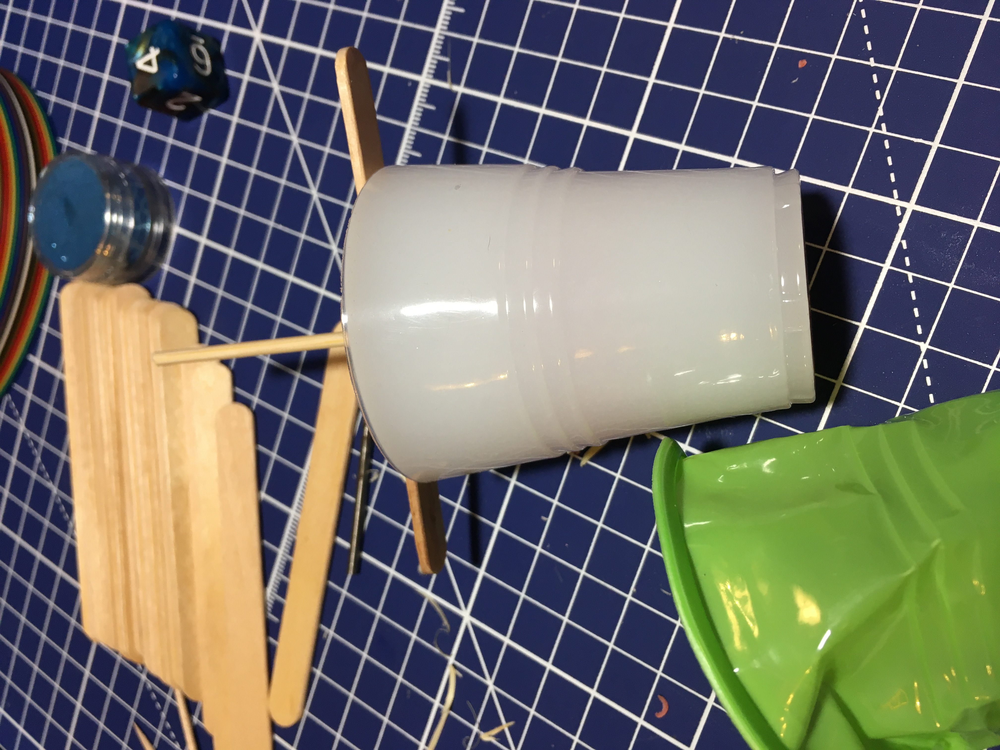
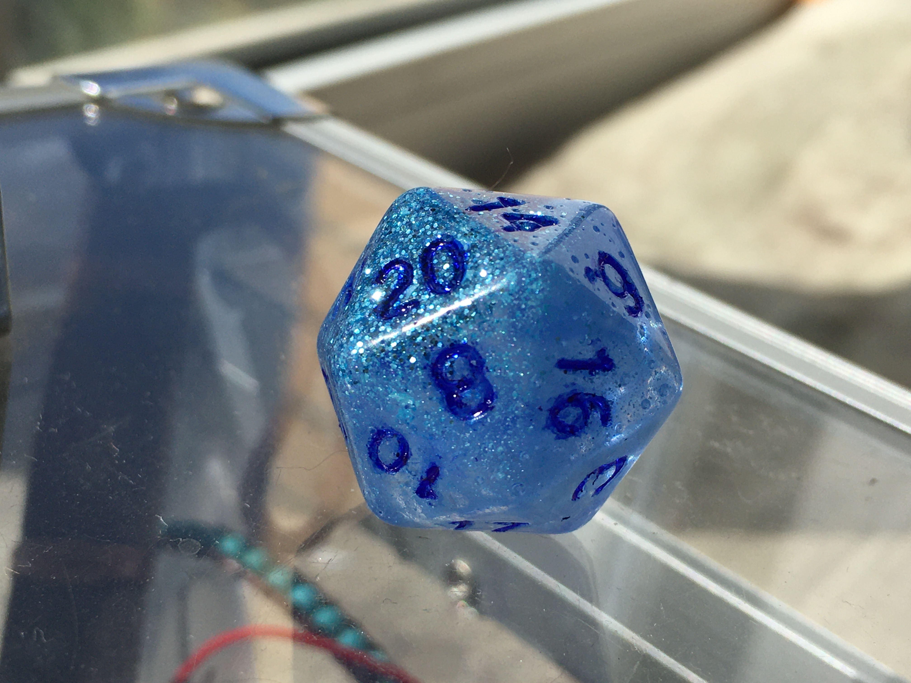
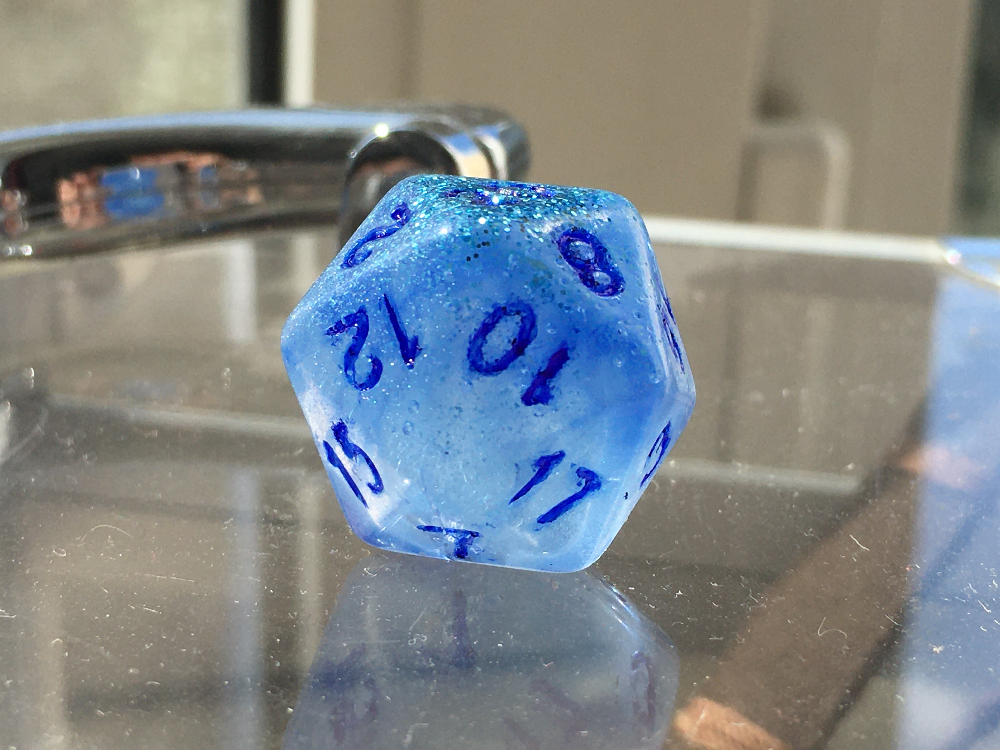

Прошу винить Инстаграм в том, что мне захотелось делать кубики из эпоксидной смолы.

В силиконовых формах и в отлитых кубиках неизбежно образуются пузырьки. 

Пузырьки делают силикон менее прозрачным и переносят свои неровности на отливаемое изделие. 
Кубики, отлитые в неровной форме, теряют изящество, а наличие пузырьков внутри эпоксидки делает их мутными. 

## Вакуумная камера

Поэтому отливать кубики имеет смысл только в [вакуумной камере](/ru/make/vacuum-camera), которая проводит процесс дегазации, удаляя все пузырьки из тщательно перемешанной смеси. 

Я замечал, что именно после смешивания двух компонентов все больше и больше пузырьков воздуха появляется после каждого оборота при помешивании. 
В каких-то инструкциях сказано, что форма края того предмета, которым вы размешиваете компоненты, может создавать больше или меньше пузырьков, но я не хочу заморачиваться с такой деталью и размешиваю обычными палочками от мороженого.

Далее в этой заметке я покажу кубики, сделанные с использованием моей самодельной вакуумной камеры. Следите за обновленями в Твиттере.

## Ссылки

Толковые видео на Ютюбе, по процессу отливки

 - https://www.youtube.com/watch?v=iRDte2j54F0
 - https://www.youtube.com/watch?v=gKTBSMqBKxs
 - https://www.youtube.com/watch?v=Z0jN06v7lMM

 Крутые примеры из Инсты и Твиттера

 - Phoenix https://www.instagram.com/p/CWEHHF1sKKN/
 - Bloodborne https://www.instagram.com/p/CU0pYV8BEV7/
 - Necrotic Void https://www.instagram.com/p/CRW3aYCLdhL/
 - Beyond the deep https://twitter.com/lizardcatdice/status/1482409017720770560
 - кубики с магическим вау-вау эликсиром внутри https://twitter.com/WitchDoctorDice/status/1479650394750038019