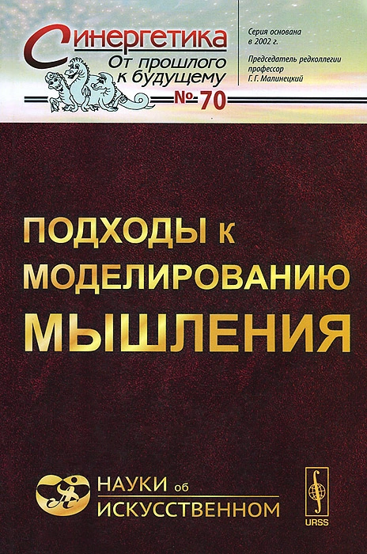
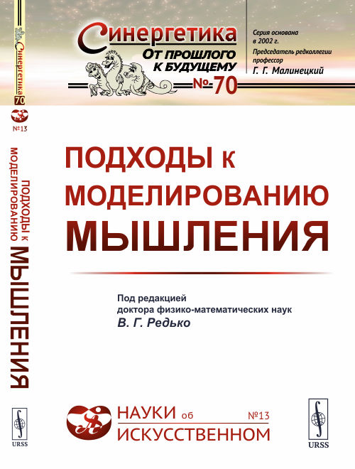

Отдельный раздел трудов, которым занимается мой научный руководитель, - это [моделирование восприятия](http://math.nsc.ru/AP/ScientificDiscovery/pages/Brain%20activity%20perception_rus.html). Вот мой небольшой вклад в науку.

## 2014

Витяев Е.Е., Неупокоев Н.В. [Формальная модель восприятия и образа как неподвижной точки предвосхищений](http://www.math.nsc.ru/AP/ScientificDiscovery/PDF/model_of_perception_sbornik.pdf). [Подходы к моделированию мышления.](http://urss.ru/cgi-bin/db.pl?lang=en&blang=en&page=Book&id=257246) (сборник под ред. д.ф.-м.н. В.Г. Редько). УРСС Эдиториал, Москва, 2014г., стр. 155-172. 

Подходы к моделированию мышления. Первое издание.

Подходы к моделированию мышления. Второе издание.

Темная обложка первого издания мне лично больше нравится.

## 2012

Витяев Е.Е., Неупокоев Н.В. [Математическая модель восприятия и образа.](http://www.math.nsc.ru/AP/ScientificDiscovery/PDF/mathematical_model_of_percepsion_and_pattern.pdf) Информационные технологии в гуманитарных исследованиях, Вып.17, ИАЭТ СО РАН, Новосибирск, 2012г., стр. 63-72.

Витяев Е.Е., Неупокоев Н.В. [Формальная модель восприятия и образа как неподвижной точки предвосхищений.](http://www.niisi.ru/iont/ni/Journal/V6/N1/VityaevNeupokoev.pdf) [Нейроинформатика](https://www.niisi.ru/iont/ni/Journal/), 2012г., том 6, № 1, стр. 28-41