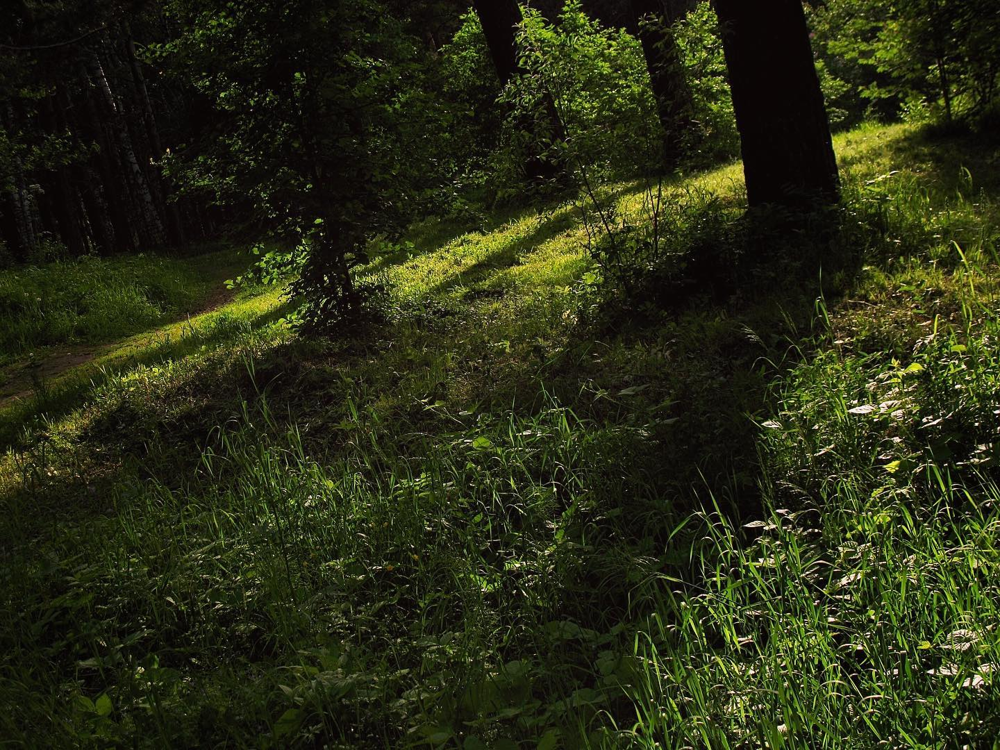

Наверное так и хочется пойти на эти теплые лучики тепла. Но мы-то знаем из сказок, что нас там будет поджиать либо баба яга, либо пряничный домик. А в прозаическом подходе это будут промокшие кеды и штаны обклееные семенами трав и репейника. и еще толпы комаров ждут там в траве чтобы отведать свежей крови

https://nbcrs.org/regions/novosibirskaya-oblast/

https://poiskputi.ru/routes/district/sibirskij/region/novosibirskij/index.html

## Вопросы на засыпку

- Какие редкие растения можно найти в области?
- Водятся ли у нас светлячки?