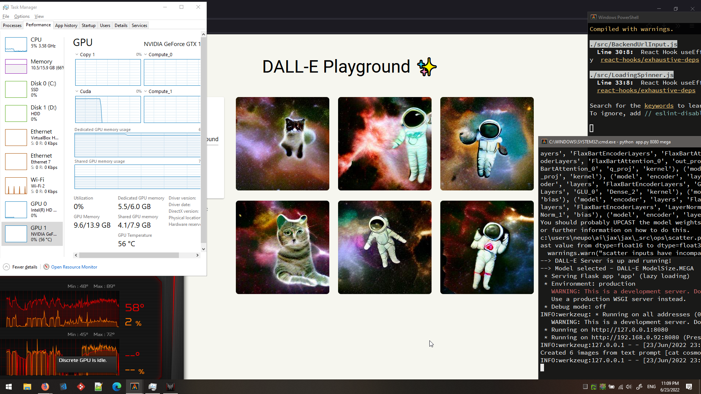
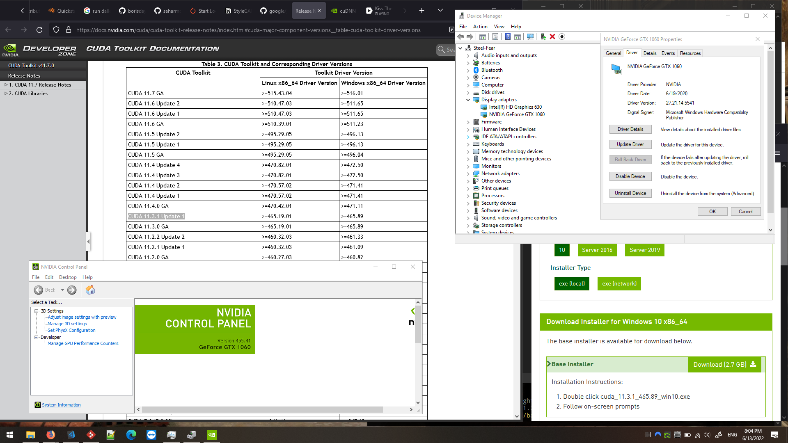
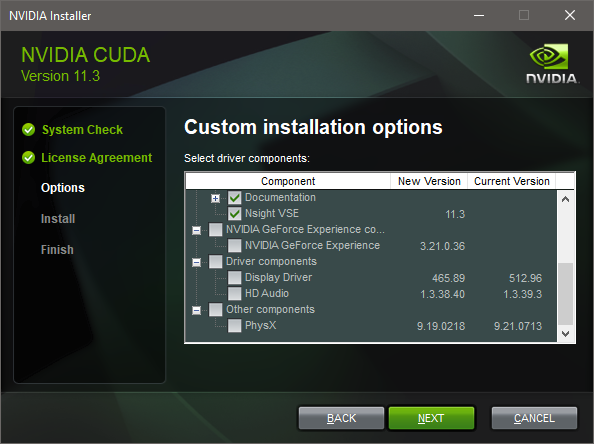
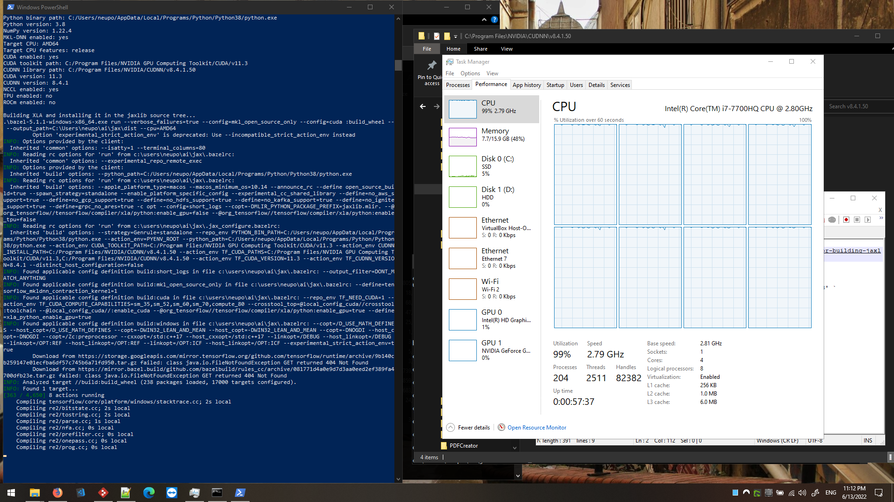
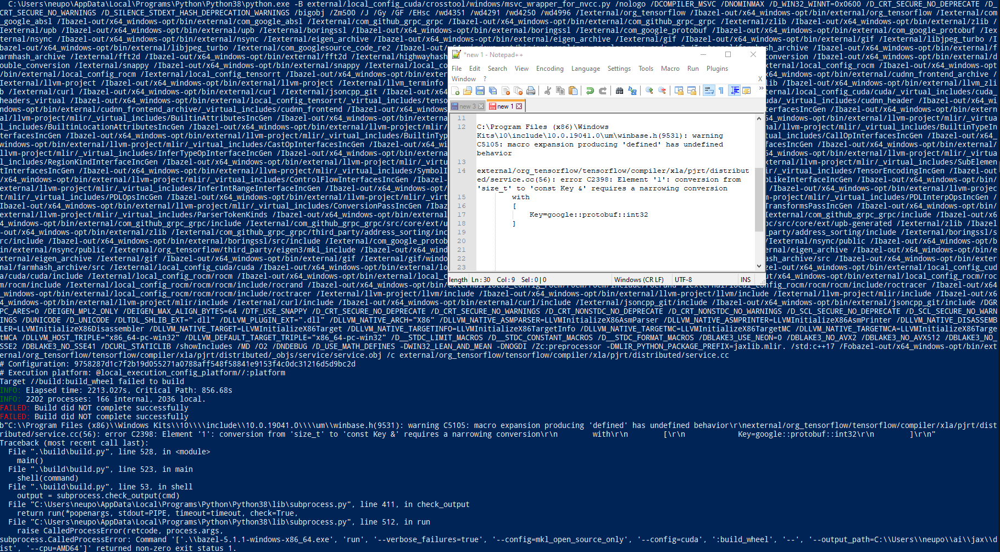
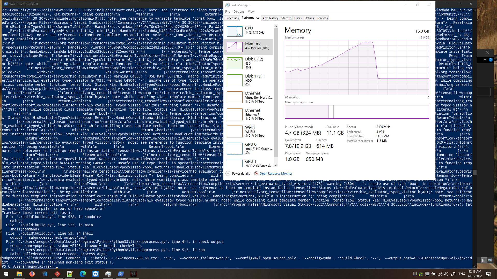

Prompt for generating a featured picture: cat cosmonaut floating in deep space with colorful nebulas on the background

# Crazy data scientist diary

Full collection of tricks and fixes required to run TensorFlow on Windows compiled with the latest Visual Studio 2022.




## Day 3

https://twitter.com/mikolasan/status/1536575253312221185

I want to create AI-generated cover pictures for my articles. I want to try DALL-E for this purpose, but mini online version is so popular that it even cannot handle all requests.


Thus I'm installing a local version onto my laptop.

So the first step is to install the correct tools. I'm going with

- CUDA 11.3.1 (not the latest, just saw it in PyTorch [support table](https://pytorch.org/get-started/locally/))
- cuDNN 8.4 (latest for 11.x)
- NVIDIA Graphics Driver 512.96 (latest)


I usually do not update video drivers, but here is a picture to explain why the graphics driver must be updated



Next step is CUDA. Go to advanced mode and disable some old payload that comes in the bundle.



I'm not sure why but I need to [compile JAX from source](https://jax.readthedocs.io/en/latest/developer.html#additional-notes-for-building-jaxlib-from-source-on-windows). And it's an nuclear mix of Windows and Linux tools. For example

> Open PowerShell, and make sure MSYS2 is in the path of the current session

According to my personal beliefs, this is a recipe for disaster 🙉


```powershell
python .\build\build.py `
  --enable_cuda `
  --cuda_path='C:/Program Files/NVIDIA GPU Computing Toolkit/CUDA/v11.3' `
  --cudnn_path='C:/Program Files/NVIDIA/CUDNN/v8.4.1.50' `
  --cuda_version='11.3' `
  --cudnn_version='8.4.1' `
  --bazel_options='--local_cpu_resources=1'
```

It's building now. However exception still occurred in the beginning 😬



The fact that I need to turn my fans to max in this project is bothering me.

In the end it failed because the compiler was out of heap space 😠


## Day 4

https://twitter.com/mikolasan/status/1536923666398580736

I restarted the build process and it advanced further. Now it stopped at the point where library developers do not trust Microsoft developers. I need to lull the build system that we can trust Visual Studio 2022.


I was naïve. I should never trust my life to the compiler

```
C:\Program Files (x86)\Windows Kits\10\include\10.0.19041.0\um\winbase.h(9531): warning C5105: macro expansion producing 'defined' has undefined behavior

external/org_tensorflow/tensorflow/compiler/xla/pjrt/distributed/service.cc(56): error C2398: Element '1': conversion from 'size_t' to 'const Key &' requires a narrowing conversion
        with
        [
            Key=google::protobuf::int32
        ]
```



Maybe I don't understand bazel, but it always restarts the build from the beginning and very frequently just skyrockets in demand of memory. The Langoliers from JAX.




## Day 5

I've installed [Alacritty terminal](https://github.com/alacritty/alacritty) on Windows and more than happy with it.

- it's configurable
- it's portable (only 4MB)
- it runs on GPU
- it supports emoji and color output

But inside you still have cmd.exe or powershell. 

Here is my config `%APPDATA%\alacritty\alacritty.yml`:

```yaml
# Configuration for Alacritty, the GPU enhanced terminal emulator.

window:
  opacity: 0.9
  dimensions:
    columns: 120
    lines: 30

  padding:
    x: 5
    y: 5

  decorations: full

# Font configuration
font:
  # Normal (roman) font face
  normal:
    family: Source Code Pro

    # The `style` can be specified to pick a specific face.
    style: Medium
  size: 13.0
colors:
  # Default colors
  primary:
    background: '#000000'
    foreground: '#eaeaea'

selection:
  save_to_clipboard: true

shell:
  program: cmd.exe
  args:
    - /k "C:\Program Files\Microsoft Visual Studio\2022\Community\Common7\Tools\VsDevCmd.bat"

working_directory: C:\Users\neupo\

```

Beautiful!

A usual finale of this evening (and more samples of Source Pro font)

