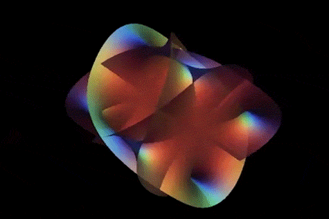

_Math club notes_

I'm a mathematician. On my homepage I want to have something that would highlight this. Like an animation of some elusive manifold. A good friend of mine [found mesmeraizing aimation](https://www.reddit.com/r/DMT/comments/evy01l/have_you_seen_this_its_a_calabiyau_manifold/) of Calabi-Yau manifold. So let's implement it!

By the way, check this out, the [quadridimensional version](http://www.lactamme.polytechnique.fr/Mosaic/images/CAYA.K1.0129.21.1.M.D/display.html)

### Other vizualizations

- http://members.wolfram.com/jeffb/visualization/stringtheory2.shtml
- 3D printing models https://people.math.harvard.edu/~knill/3dprinter/exhibits/calabiyau/index.html
- Formulae, explanation and d3.js code https://observablehq.com/@sw1227/calabi-yau-manifold-3d
- Wireframe version with Three.js https://analyticphysics.com/Higher%20Dimensions/Visualizing%20Calabi-Yau%20Manifolds.htm

## The math

So to bring this animation to my website, I need to [undestand the math behind it](http://www.scholarpedia.org/article/Calabi-Yau_manifold). And then understand [how the manifold can be vizualized](https://analyticphysics.com/Higher%20Dimensions/Visualizing%20Calabi-Yau%20Manifolds.htm).

- About hidden dimensions https://plus.maths.org/content/hidden-dimensions
- About each of 10 dimensions https://phys.org/news/2014-12-universe-dimensions.html

## The code

Before integrating it into my layout and maybe even into React.js I start with vanilla HTML + JS on [Codepen](https://codepen.io/mikolasan/pen/WNzKEZO?editors=1111). 

- Three.js https://threejs.org/docs/index.html#manual/en/introduction/Installation
- example https://github.com/mrdoob/three.js/blob/dev/examples/index.html
- more examples with explanations https://r105.threejsfundamentals.org/threejs/lessons/threejs-custom-buffergeometry.html

## Further reading

- Another cool geometrical form is a [lemniscate](https://mathworld.wolfram.com/Lemniscate.html)
- More amazing visualizations from [Shingo WATANABE](https://sw1227.github.io/portfolio/#/)