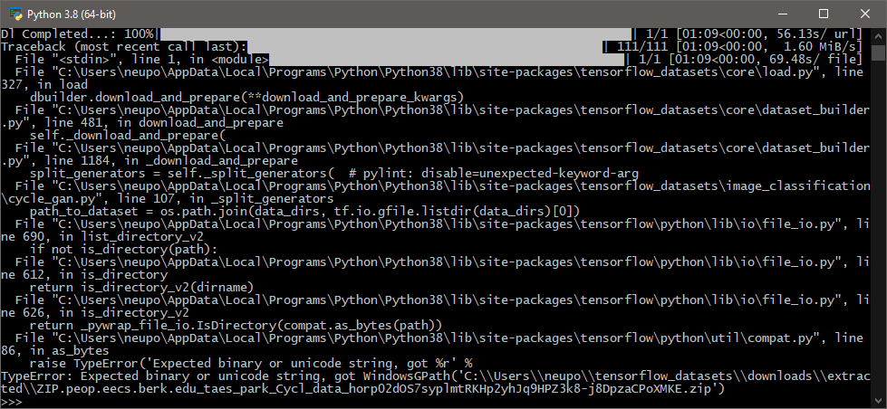
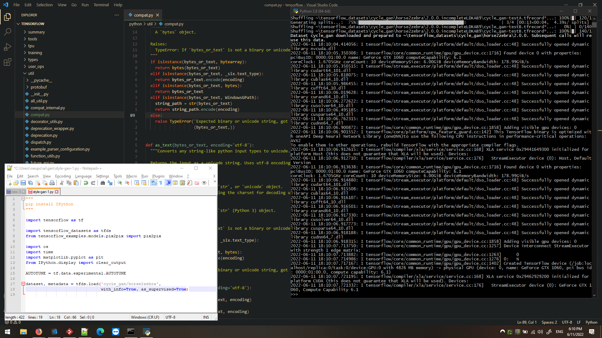
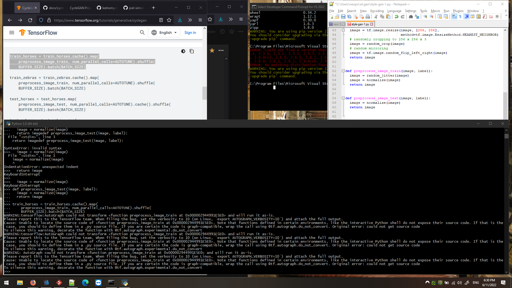
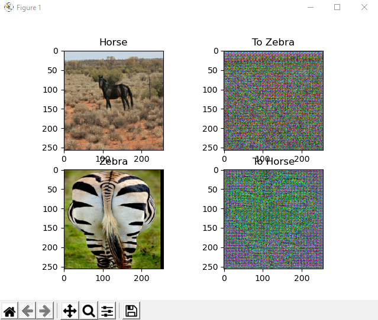
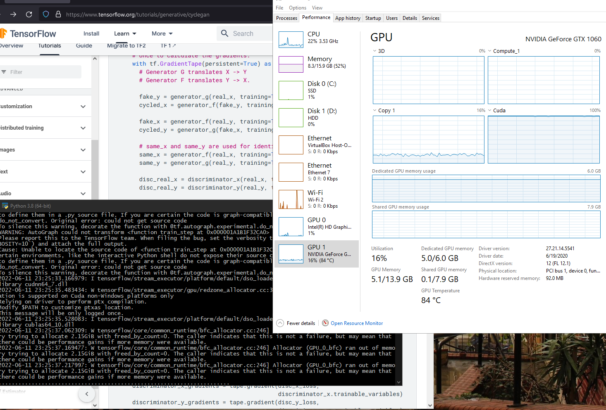
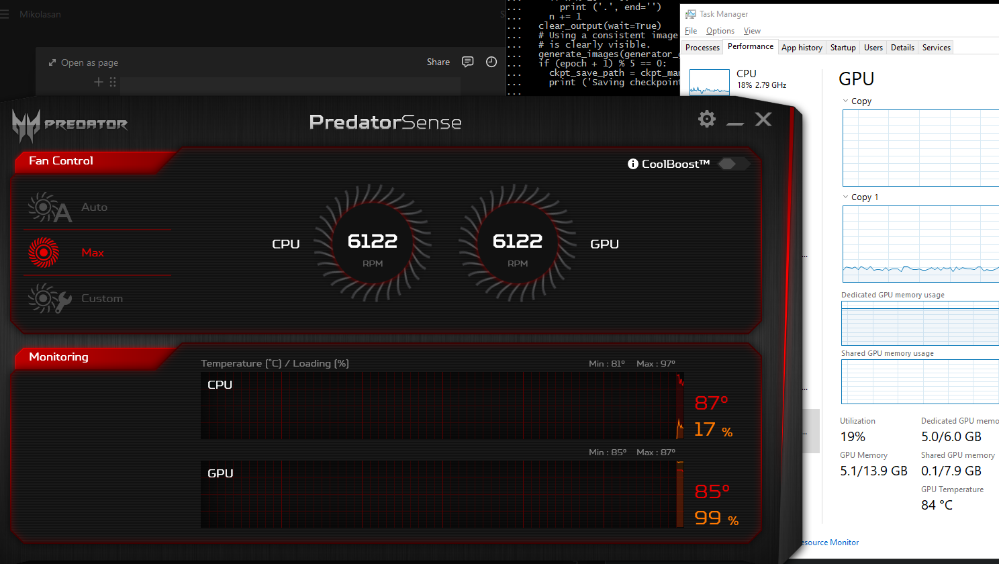

My plan is to play with CycleGAN and to read 2 papers

- [2018] Large Scale GAN Training for High Fidelity Natural Image Synthesis
- [2017] Unpaired Image-to-Image Translation using Cycle-Consistent Adversarial Networks


I'm following the tutorial from [TensorFlow documentation](https://www.tensorflow.org/tutorials/generative/cyclegan)

While this artcicle is in draft state I'm going to keep here only my questions along the way. Later I will compile a big story how to train your own model and so on.

## Newbie questions

### Jupyter notebook or Python interpreter?

[Jupyter notebook](/science/everything-you-need-to-know-about-jupyter-notebook) or filling a script line by line and executing it?


### Keras vs PyTorch vs TensorFlow

Is there a difference? When you see implementation in all frameworks, which one to chose and why?

## Follow along

### How to check TensorFlow version

```python
tf.version.VERSION
# or
tf._version__
```

Just a reminder that there is a big difference between TensorFlow 1 and 2. They hate each other and many projects and tutorials still use version 1. I highly recommend do not try to upgrade projects from 1 to 2. Especially if you do not understand how the project works. Even their creators do not know how it works, so don't even try.

## Fixing tensorflow_datasets

Are you still wondering why data scientist jobs pay so well?

I run just the beginning in Python interpreter

```python
"""
https://www.tensorflow.org/tutorials/generative/cyclegan
pip install IPython
"""

import tensorflow as tf

import tensorflow_datasets as tfds
from tensorflow_examples.models.pix2pix import pix2pix

import os
import time
import matplotlib.pyplot as plt
from IPython.display import clear_output

AUTOTUNE = tf.data.experimental.AUTOTUNE
plt.interactive(True) # for windows when running from python interpreter

dataset, metadata = tfds.load('cycle_gan/horse2zebra',
                              with_info=True, as_supervised=True)
```

and it fails with this error



```
TypeError: Expected binary or unicode string, got WindowsGPath('C:\\Users\\<and so on>')
```

Hell yeah, I fixed it! And please don't tell me that it's already been fixed in version >= 2.3 of TensorFlow (yes, it's fixed ). In TensorFlow 2.3 you need to fix one function in **python/util/compat.py**

```python{8-10}
def as_bytes(bytes_or_text, encoding='utf-8'):
  if isinstance(bytes_or_text, bytearray):
    return bytes(bytes_or_text)
  elif isinstance(bytes_or_text, _six.text_type):
    return bytes_or_text.encode(encoding)
  elif isinstance(bytes_or_text, bytes):
    return bytes_or_text
  elif isinstance(bytes_or_text, WindowsGPath):
    string_path = str(bytes_or_text)
    return string_path.encode(encoding)
  else:
    raise TypeError('Expected binary or unicode string, got %r' %
                    (bytes_or_text,))
```




I remember back in the day I had a few dates when a girl was very talkative. It didn't end well. For me it was a first sign that she is not my type.



Very long warning message. Too long that I think it's an error.

## Experiments

Out of all zebras I've got this. This clearly defines my luck



### Temperature

These horses are making my computer very hot 🔥🔥🔥 85C



Then I remembered about the tool to control fans and turned them to the max speed. It decreased GPU temperature from 88C to 81C.

But people say that:

if your GPU is not at ~80-90 C, this means that it is not working at full power, and you are losing some performance.

😒



I'm reading StackOverflow to find an answer on: _How to slowdown Cuda in TensorFlow to keep GPU cool?_

And someone explains their setup:

> My GPU is a water cooled gtx 1080 "Super-clocked" edition in a 24/7 refrigerated room. ❄️