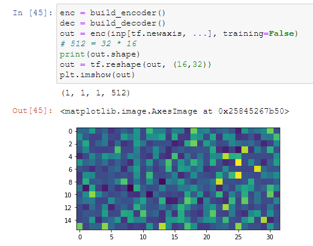

## Load images

I'm using TensorFlow and I need to scale black and white image from 512x512 pixels stored in `tf.Tensor` to 128x96 and add pixelation effect to the image using.


```py
import tensorflow as tf

# Load the image as a tf.Tensor
image = tf.io.read_file('path/to/image.jpg')
image = tf.image.decode_jpeg(image, channels=1) # assuming the image is black and white

# Scale the image to 128x96 pixels
image = tf.image.resize(image, [96, 128])

# Add pixelation effect
block_size = 8
image = tf.nn.avg_pool(image, ksize=[block_size, block_size], strides=[block_size, block_size], padding='VALID')

# Cast the image back to uint8 data type and save it
image = tf.cast(image, tf.uint8)
image = tf.image.encode_jpeg(image)
tf.io.write_file('path/to/scaled_and_pixelated_image.jpg', image)
```

In this code, we first load the image as a `tf.Tensor` using `tf.io.read_file` and `tf.image.decode_jpeg` functions. We then use the `tf.image.resize` function to scale the image to 128x96 pixels. Finally, we apply the pixelation effect using the `tf.nn.avg_pool` function with a block size of 8x8 pixels.

Note that the `tf.nn.avg_pool` function returns a `float32` tensor, so we need to cast it back to `uint8` data type before saving the image using `tf.image.encode_jpeg` and `tf.io.write_file` functions.

## Encoder-decoder

The encoder network is used to extract high-level features from the input data and convert it into a compressed representation that retains the most important information from the input. The encoder typically consists of several convolutional layers that are used to reduce the spatial dimensionality of the input data while increasing its depth.



The decoder network is used to take the compressed representation generated by the encoder and reconstruct the original input data. The decoder typically consists of several upsampling layers that increase the spatial dimensionality of the compressed representation while decreasing its depth.

The encoder-decoder architecture is often referred to as an "autoencoder". The term "autoencoder" comes from the fact that the encoder and decoder are trained together, with the goal of minimizing the difference between the original input and the reconstructed output. 

## Discriminator

How to design a discriminator for U-Net architecture when input images have size is 256x256, but output size is 128x96?

We will use a patch-based discriminator. This type of discriminator takes small patches from both the input and output images and classifies them as real or fake.

```py
import tensorflow as tf

def build_discriminator():
    # Input layer for the original 256x256 image
    input_image = tf.keras.layers.Input(shape=(256, 256, 1))

    # Downsample the original image to 128x96
    downsampled_image = tf.keras.layers.Conv2D(64, (4, 4), strides=(2, 2), padding='same')(input_image)
    downsampled_image = tf.keras.layers.LeakyReLU(alpha=0.2)(downsampled_image)
    downsampled_image = tf.keras.layers.Conv2D(128, (4, 4), strides=(2, 2), padding='same')(downsampled_image)
    downsampled_image = tf.keras.layers.BatchNormalization()(downsampled_image)
    downsampled_image = tf.keras.layers.LeakyReLU(alpha=0.2)(downsampled_image)

    # Input layer for the generator output
    generated_output = tf.keras.layers.Input(shape=(128, 96, 1))

    # Concatenate the downsampled original image and the generated output
    combined_images = tf.keras.layers.concatenate([downsampled_image, generated_output], axis=-1)

    # Convolutional layers
    x = tf.keras.layers.Conv2D(256, (4, 4), strides=(1, 1), padding='same')(combined_images)
    x = tf.keras.layers.BatchNormalization()(x)
    x = tf.keras.layers.LeakyReLU(alpha=0.2)(x)
    x = tf.keras.layers.Conv2D(512, (4, 4), strides=(1, 1), padding='same')(x)
    x = tf.keras.layers.BatchNormalization()(x)
    x = tf.keras.layers.LeakyReLU(alpha=0.2)(x)
    x = tf.keras.layers.Flatten()(x)
    x = tf.keras.layers.Dense(1)(x)

    # Create a model with the input and output layers
    model = tf.keras.models.Model(inputs=[input_image, generated_output], outputs=x)

    return model
```

The distinction between L1 and L2 regularization is that L1's additions to cost correspond to the absolute value of parameter sizes, whereas L2's additions correspond to the _square_ of these. The net effect of this is that L1 regularization tends to lead to the inclusion of a smaller number of larger-sized parameters in the model, while L2 regularization tends to lead to the inclusion of a larger number of smaller-sized parameters. [1]

**Dropout** simply pretends that a randomly selected proportion of the neurons in each layer don't exist during each round of training.

[1] - Jon Krohn - Deep Learning Illustrated: A Visual, Interactive Guide to Artificial Intelligence


## Reference

- Original StyleGAN - (2017) [Exploring the structure of a real-time, arbitrary neural artistic stylization network](https://arxiv.org/pdf/1705.06830.pdf). TensorFlow [tutorial](https://www.tensorflow.org/hub/tutorials/tf2_arbitrary_image_stylization)
- How to get good quiality? - BigGAN - (2019) [Large scale GAN training for hide fidelity natural image synthesis](https://arxiv.org/pdf/1809.11096.pdf)
- Unpaired training - CycleGAN (2020) [Unpaired Image-to-Image Translation using Cycle-Consistent Adversarial Networks](https://arxiv.org/pdf/1703.10593.pdf)
- U-Net archetecture with encoder-decoder - (2015) [U-Net: Convolutional Networks for Biomedical Image Segmentation](https://arxiv.org/pdf/1505.04597.pdf)
- Conditional GAN  uses PatchGAN to fight the blur in generator - (2018) [Image-to-Image Translation with Conditional Adversarial Networks](https://arxiv.org/pdf/1611.07004.pdf)
- [Torch example](https://inikolaeva.medium.com/make-pixel-art-in-seconds-with-machine-learning-e1b1974ba572) and ready to use models for making pixel art