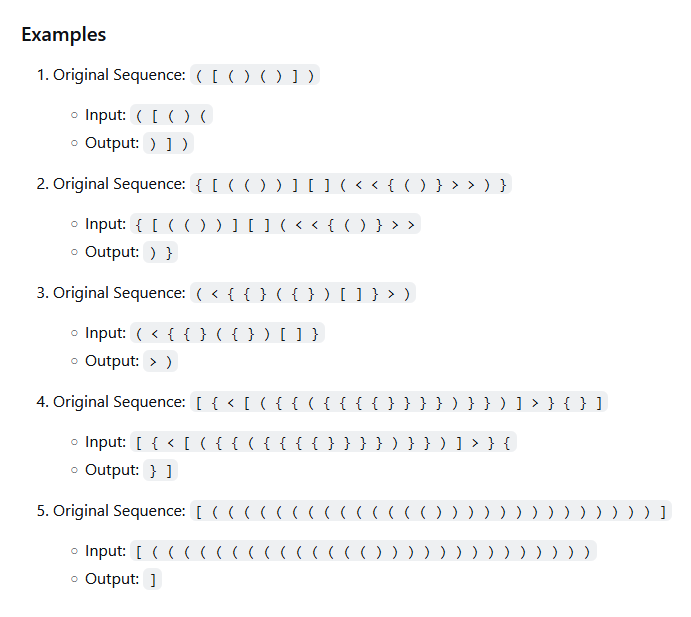

First, I got carried away with researching what a [Dyck language](https://en.wikipedia.org/wiki/Dyck_language) is. I was damn certain that some geeks already released an online service for converting natural languages to Dyck. NO! There is none.

So I decided to write one.

## Literature

- There is an order between words of equal length. They transform using a special rule and all together make a [tamari lattice](https://en.wikipedia.org/wiki/Tamari_lattice). Amount of elements there is a Catalan number. [ref](https://blogs.ams.org/visualinsight/2015/07/15/dyck-words/)
- There are another objects that under some conditions also counted by Catalan numbers. Thus can be created a bijection between such objects. At this point we are going to consider Dyck path (not words, defined in the article) and we will build a bijection to binary trees [ref](https://www.researchgate.net/publication/1888140_Catalan's_intervals_and_realizers_of_triangulations). [related question](https://math.stackexchange.com/questions/3062462/catalan-numbers-bijection-between-applications-of-a-binary-operator-and-dyck-wo) about the bijection, and [some notes](https://web.archive.org/web/20210506160355/http://math.sfsu.edu/federico/Clase/EC/Homework/3.3.Jorge.pdf)
- Also [noncrossing partitions](https://web.math.ucsb.edu/~jon.mccammond/papers/nc-survey-official.pdf) can be ordered and hence similar to trees and paths. [Phagocyte lattice](https://citeseerx.ist.psu.edu/doc/10.1.1.106.7002) ?
- [Some notation](http://www.numdam.org/article/MSH_1995__131__39_0.pdf) on how to transition from Dyck words to paths

According to the notes (from someone's howework (?)):

> Each time you go up in path $P$, draw the left son from the last vertex you drew in tree $f(P)$. Each time you go down in path $P$, go up one vertex in tree $f(P)$ and draw the right son of that vertex.

And reverse:

> Let $T$ be a binary tree. Start in the root of $T$. If you can go down left in $T$, do it and go up in your Dyck Path. If you can’t, then go up until you can go down right where you haven’t been before in $T$ and go down in the Dyck Path.

Maybe related [about tree traversal](https://cs.stackexchange.com/questions/136923/why-does-my-code-work-bijecting-binary-trees-to-dyck-paths)

To my big surprise researchers are trying to use Large Language Models like GPT to predict word endings in the Dyck language. Found in [Big Bench benchmark](https://github.com/google/BIG-bench/tree/main/bigbench/benchmark_tasks/dyck_languages)

For some reason I looked into the bijection between binary trees and Dyck words. It's not a trivial thing I must say.

But how do we encode alphabet or words from English language as binary trees? Morse code?