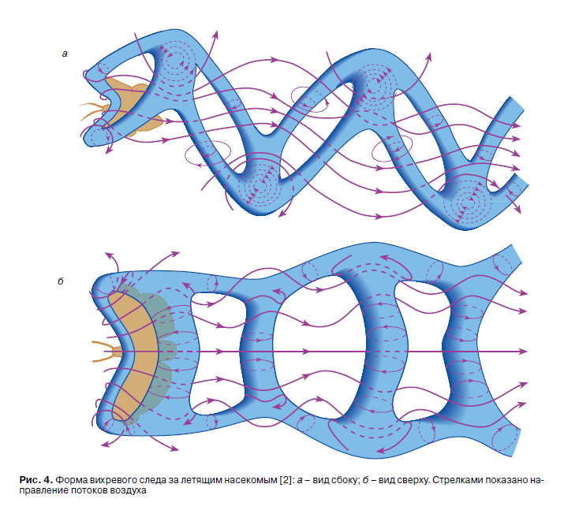

So why we don't have planes that flap wings?

I found my files from 2010. Back then I found Brodsky's monograph [1988] (picture from the book), but today even Wikipedia has so detailed article

Bees are solving the traveling salesman NP-hard problem 🤯