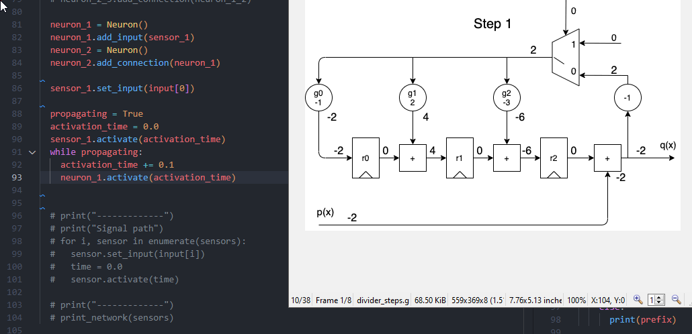
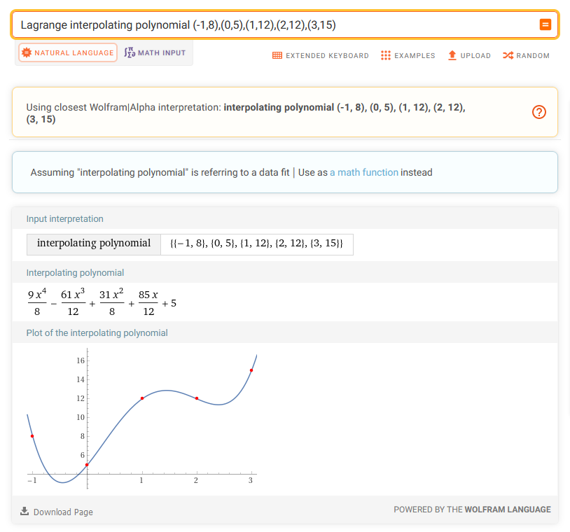
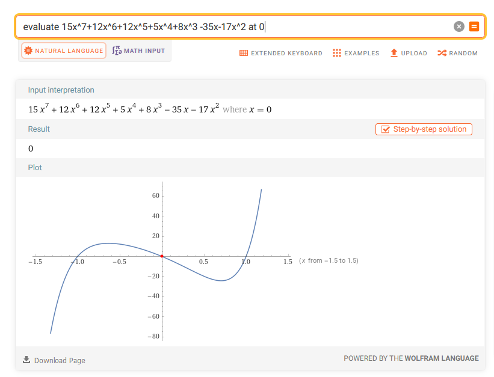
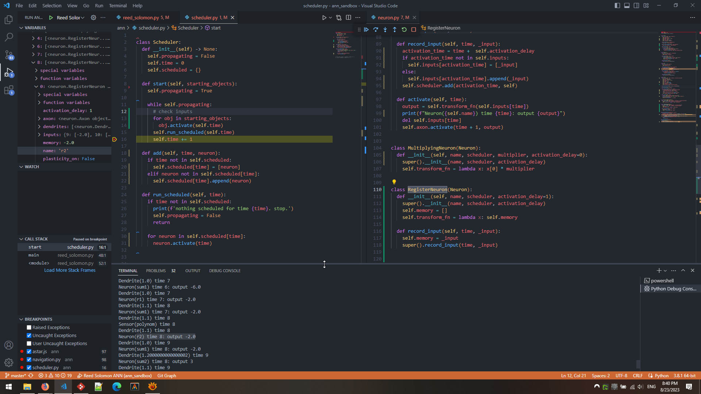

Today I came up with another weird combination. How can I use Reed-Solomon error correction on directed acyclic graph? In another words this graph is somewhat dynamic and some routes can be altered (edges removed), and we nee to update other weights in order to restore the missing path.

For some reason I just like Reed-Solomon codes by their name, it’s the first thing that pops in my mind, but any other fault tolerance methodology should work too.

So first we should keep redundancy - different paths can carry the same information.

Wait, how the path can become information itself?



[https://tomverbeure.github.io/2022/08/07/Reed-Solomon.html](https://tomverbeure.github.io/2022/08/07/Reed-Solomon.html)

[https://www.embeddedrelated.com/showarticle/1182.php](https://www.embeddedrelated.com/showarticle/1182.php) (over Galois fields)

[http://pfister.ee.duke.edu/courses/ecen604/rspoly.pdf](http://pfister.ee.duke.edu/courses/ecen604/rspoly.pdf) - decoder in complex numbers

[](https://en.wikiversity.org/wiki/Reed%E2%80%93Solomon_codes_for_coders#RS_encoding)[https://en.wikiversity.org/wiki/Reed–Solomon_codes_for_coders#RS_encoding](https://en.wikiversity.org/wiki/Reed%E2%80%93Solomon_codes_for_coders#RS_encoding) - full Python code

[https://github.com/GillesC/Communication-Model-Python/blob/master/unireedsolomon/rs.py#L115](https://github.com/GillesC/Communication-Model-Python/blob/master/unireedsolomon/rs.py#L115) - popular Python library unireedsolomon

Berlekamp-Massey algorithm for Binary codes [https://www-users.cse.umn.edu/~garrett/students/reu/MB_algorithm.pdf](https://www-users.cse.umn.edu/~garrett/students/reu/MB_algorithm.pdf)

RS codes - general outline, chapters from a real book [https://users.encs.concordia.ca/~msoleyma/ELEC464/ELEC_464_2019/RS-Decoding.pdf](https://users.encs.concordia.ca/~msoleyma/ELEC464/ELEC_464_2019/RS-Decoding.pdf)

Short introduction to modern approach (nice formulas) [https://shanbhag.ece.illinois.edu/publications/sarwt-tvlsi-2001.pdf](https://shanbhag.ece.illinois.edu/publications/sarwt-tvlsi-2001.pdf)

New improvements [https://ietresearch.onlinelibrary.wiley.com/doi/10.1049/iet-com.2015.0500#](https://ietresearch.onlinelibrary.wiley.com/doi/10.1049/iet-com.2015.0500#)

Lagrangian Interpolation (from dots to polynomial) [https://www.dcode.fr/lagrange-interpolating-polynomial](https://www.dcode.fr/lagrange-interpolating-polynomial)


```
Lagrange interpolating polynomial (-1,8),(0,5),(1,12),(2,12),(3,15) (9 x^4)/8 - (61 x^3)/12 + (31 x^2)/8 + (85 x)/12 + 5
```



```
evaluate f(x)=8+5x+12x^2+12x^3+15x^4 at x=-1 a-b+c-d+e=18, a=8, a+b+c+d+e=52, a+2b+4c+8d+16e=402, a+3b+9c+27d+81e=1670 (Gaussian elimination)
```

```
(15x^7+12x^6+12x^5+5x^4+8x^3)/(x^3-x) evaluate 15x^7+12x^6+12x^5+5x^4+8x^3 -35x-17x^2 at 0
```

[](https://www.wolframalpha.com/input?i=evaluate+15x%5E7%2B13x%5E6%2B12x%5E5%2B5x%5E4%2B8x%5E3+-35x-17x%5E2+at+0)[https://www.wolframalpha.com/input?i=evaluate+15x^7%2B13x^6%2B12x^5%2B5x^4%2B8x^3+-35x-17x^2+at+0](https://www.wolframalpha.com/input?i=evaluate+15x%5E7%2B13x%5E6%2B12x%5E5%2B5x%5E4%2B8x%5E3+-35x-17x%5E2+at+0)

- Reed-Solomon codes are widely used in deep-space communication, compact disc audio systems, and frequency-hopped systems. However, the VLSI implementation of these codes is still very complex, and encoding/decoding by using these chips is very time consuming. Neural network implementation of these codes has resulted in reduced complexity, enhanced error correction capability, fast processing, and improved signal-to-noise ratio. The proposed scheme requires less bandwidth, utilizes soft decision decoding, and exploits the redundancy in the English language.

[https://ui.adsabs.harvard.edu/abs/1991SPIE.1469..463H/abstract](https://ui.adsabs.harvard.edu/abs/1991SPIE.1469..463H/abstract)

- Deep learning recently shows outstanding potential in channel decoding optimization, but its effect on the decoding of Reed-Solomon (RS) codes has yet to be explored. In this paper, we propose a RS decoder based on deep learning for the first time, and pave a new way to improve the existing RS decoding algorithms. We exploit a deep neural network (DNN) to estimate the error numbers of the received codewords, and according to the estimation results, a novel decoder is designed, which can adjust the most suitable decoding method to each received codeword automatically. Experiments show that for (7, 3), (15, 9) and (63, 55) RS codes, the average computational complexity of our decoder can be reduced by 68.96 %, 62.38 %, 50.61 % respectively compared with the HDD-LCC algorithm.

[https://ieeexplore.ieee.org/document/9181187](https://ieeexplore.ieee.org/document/9181187)

[https://drpress.org/ojs/index.php/HSET/article/view/6012/5821](https://drpress.org/ojs/index.php/HSET/article/view/6012/5821) - and maybe more examples just for decoding

[https://github.com/GillesC/Communication-Model-Python/blob/master/unireedsolomon/rs.py](https://github.com/GillesC/Communication-Model-Python/blob/master/unireedsolomon/rs.py)

Implementation with discrete gates

Decoding theory first [https://www-users.cse.umn.edu/~garrett/students/reu/MB_algorithm.pdf](https://www-users.cse.umn.edu/~garrett/students/reu/MB_algorithm.pdf)

[https://tomverbeure.github.io/2022/08/07/Reed-Solomon.html](https://tomverbeure.github.io/2022/08/07/Reed-Solomon.html) - encoding



[](https://cas.cnu.ac.kr/wp-data/international_journal/%5B2018%5D%20Area%20optimized%20Syndrome%20Calculation%20for%20Reedsolomon%20Decoder.pdf)[https://cas.cnu.ac.kr/wp-data/international_journal/[2018]](https://cas.cnu.ac.kr/wp-data/international_journal/%5B2018%5D) Area optimized Syndrome Calculation for Reedsolomon Decoder.pdf - syndromes

[https://www.iasj.net/iasj/download/4cc73688e4fa840b](https://www.iasj.net/iasj/download/4cc73688e4fa840b) formulas and diagrams with gates (low quality, I do not trust)

[https://www.eetimes.com/tutorial-linear-feedback-shift-registers-lfsrs-part-1/](https://www.eetimes.com/tutorial-linear-feedback-shift-registers-lfsrs-part-1/) - about Linear Feedback Shift Registers

D = D Flip Flop

Article to understand [https://ietresearch.onlinelibrary.wiley.com/doi/10.1049/iet-com.2015.0500#](https://ietresearch.onlinelibrary.wiley.com/doi/10.1049/iet-com.2015.0500#)