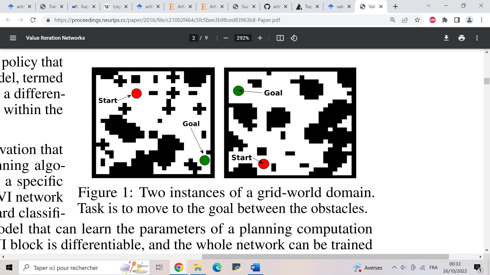
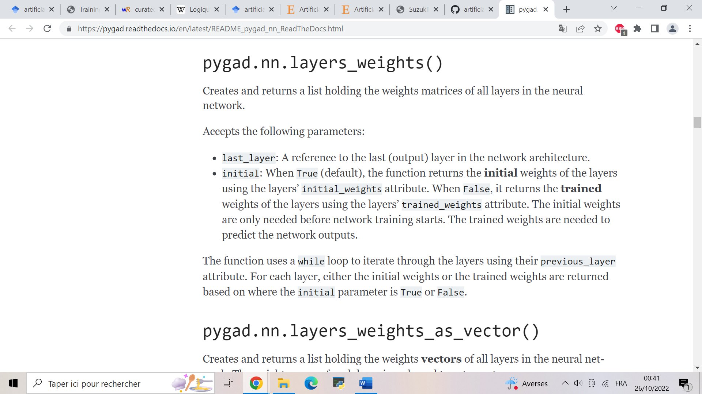

**Guest star: @mathuccino**

My advice is 

> don't focus too much on articles

## A primer

[This](https://www.sciencedirect.com/science/article/pii/S0896627320307054) is the article I was reading, it is said to be a "primer" but actually covers the mathematical foundational aspects as well as the code for "hands on" experience

I found it good to begin with because it's a "primer", which means it's simple enough for you to play with it

You can find the repo [here](https://github.com/gyyang/multitask)

But this is still a bit vague for what you asked I think

It's a compilation of examples, they have around 30

Some are from biology as I can see

But it's the "basics"

## Applying Evolutionary Artificial Neural Networks

[This repo](https://github.com/ArztSamuel/Applying_EANNs) simulates a car that mustn't touch walls

It made me think of your research because the README file states 

> A car has five front-facing sensors which measure the distance to obstacles in a given direction. The readings of these sensors serve as the input of the car's neural network.

Here, the official description 

>A 2D Unity simulation in which cars learn to navigate themselves through different courses. The cars are steered by a feedforward neural network. The weights of the network are trained using a modified genetic algorithm.

## Machine learning without any libraries

You have [this very basic implemetation](https://github.com/pavankalyan1997/Machine-learning-without-any-libraries/blob/master/8.%20ANN/ANN.py) of ANNs in Python with one hidden layer and no hidden dependencies

## Value Iteration Network (VIN)

There is this repo [here](https://github.com/itdxer/neupy)

> Exploring world with Value Iteration Network (VIN) One of the basic applications of the Value Iteration Network that learns how to find an optimal path between two points in the environment with obstacles.

from an article (2017 Aviv Tamar, Yi Wu, Garrett Thomas, Sergey Levine, and Pieter Abbeel - [Value Iteration Networks](https://arxiv.org/pdf/1602.02867.pdf))

> We introduce the value iteration network (VIN): a fully differentiable neural network with a ‘planning module’ embedded within. VINs can learn to plan, and are suitable for predicting outcomes that involve planning-based reasoning, such as policies for reinforcement learning.

Here's a bold claim accusing RL in only maximizing one action over a smart strategy

> [Typical NNs] are inherently reactive, and in particular, lack explicit planning computation. The success of reactive policies in sequential problems is due to the learning algorithm, which essentially trains a reactive policy to select actions that have good long-term consequences in its training domain.

## Simplest artificial neural network

Do you code in Go? If you do, there is [this approach](https://github.com/gokadin/ai-simplest-network), the simplest one

To keep in a corner because it's the "bone structure" of the way it works

## Building Neural Networks using NumPy

But we need a matrix at some point so how to generate it?

[Another resource](https://github.com/ahmedfgad/NumPyANN) you might want to use. And [it seems](https://pygad.readthedocs.io/en/latest/README_pygad_nn_ReadTheDocs.html) pretty handy

## Conclusion

That's what I have for now. I think it is better to start with a popular repo that works and that has been tested by many before, these are projects with many collaborators so they have visibility

Then you will focus on finding articles if needed. I am still not sure how the generation of a matrix works in your project so these approaches deserve to be compared

## Testing

I'm eager to see what will come out of this approach of running examples before reading articles.  need to check them. I don't need the solution that works. I need the solution that "thinks"

I checked only a few links today. 

A Primer has Python issues, cannot run theirs http://paper.py. Maybe I need to match their environment to the T, but I don't want to break my tensorflow 2 install. 

Cars on C# is basically a "game" made on Unity game engine - hard to use as a standalone project. It was created 6 years ago - may be problems to run it on current Unity version. Also training by genetic algorithm is no go. The result is cool tho. I saw this project somewhere before. 

So I skipped simple ANN implementations and tried VIN.I had git problems here. I found a fork with a fix. Stopped at reading how to train and how it works. I also found that VIN is implemented in PyTorch and TensorFlow which means I don't need to use neupy library. 

I thought that this will be faster. At the same time I started recording my screen: how I install and run examples in order to make educational reels for Instagram. As you understand I have no results to show atm. I have your links and description saved - it will not be lost.

## Function approximation

https://machinelearningmastery.com/neural-networks-are-function-approximators/

- function sophistication
- function properties (differentiable, continuous, smooth)
- sinusoid and exponential (infinitely differentiable so no problems) -> approx with linear regression
- strctural limitations of the network
- accuracy control

[article](https://blog.cubieserver.de/2019/approximate-function-with-neural-network/) contains source code and very good approx with 20 to 50 neurons

> ANN are universal function approximators

For a slightly more complicated function, you get an excellent approximation but with apparently many more epochs needed (the log scale for the ration Training Loss/Epoch)

https://julienpascal.github.io/post/ann_1/

## Deep Q-learning

https://observablehq.com/@mbostock/predator-and-prey

So I'm trying to find Python library for numerical differentiation. numpy should do it, but I don't see an example for function of two variables f(x, y) that depend on time - x(t), y(t).

And in math explanation I noticed one thing. I said Riemann sums, but I actually meant Taylor series expansion which is also about approximation, but in Taylor series accuracy grows with more operands we take into account.

So Python code from Jack's blog works, but I didn't put my function because I need to make an array of differentiated values. Not sure why. I wanted just to play around with things. And I stopped reading on [this](https://www.tensorflow.org/agents/tutorials/0_intro_rl)

Which is maybe what we are looking.

## Logic statements in ANN

I've found two articles, more of a good read than a coding tutorial, it seems relevant:

1. [Emulating logical gates with a neural network](https://towardsdatascience.com/emulating-logical-gates-with-a-neural-network-75c229ec4cc9)
2. [How to teach logic to your neural networks](https://medium.com/autonomous-agents/how-to-teach-logic-to-your-neuralnetworks-116215c71a49) And in this last link, you will find [a link](https://playground.tensorflow.org/#activation=sigmoid&regularization=L2&batchSize=10&dataset=xor&regDataset=reg-plane&learningRate=0.03&regularizationRate=0&noise=0&networkShape=2,2,1&seed=0.00814&showTestData=false&discretize=false&percTrainData=90&x=true&y=true&xTimesY=false&xSquared=false&ySquared=false&cosX=false&sinX=false&cosY=false&sinY=false&collectStats=false&problem=classification&initZero=false&hideText=false) to TensorFlow Playground, that could help you visualize your network. And the associated [GitHub page](https://github.com/tensorflow/playground)

Ok for the multivariable thing you don't use numpy but [SymPy](https://docs.sympy.org/latest/tutorials/intro-tutorial/calculus.html). [A more digestible tuto](https://www.askpython.com/python/examples/derivatives-in-python-sympy). It also explains how to use the chain rule

For Lotka-Volterra ordinary differential equations

- sympy and scipi http://bebi103.caltech.edu.s3-website-us-east-1.amazonaws.com/2015/tutorials/r6_sympy.html
- algebraic solution with sympy https://ipython-books.github.io/157-analyzing-a-nonlinear-differential-system-lotka-volterra-predator-prey-equations/
- scipy with plot https://scientific-python.readthedocs.io/en/latest/notebooks_rst/3_Ordinary_Differential_Equations/02_Examples/Lotka_Volterra_model.html

## Develop new actions

> If it uses fixed model of states and actions then it's not good. Is there a model that can develop new actions and adapt to the environment?

I worked on [adaptive algos](https://www.allerin.com/blog/everything-you-need-to-know-about-adaptive-neural-networks) for my med internship. it's the natural extension of ANNs apparently when coupled with the neural network approach

A man-made adaptive neural network, also called an artificial neural network, is modeled after the naturally occurring neural networks in the brains of humans and animals.

It's the same thing as an ANN pretty much

Ok so the main use is for a single-layer algo. It's called [Adaline](https://www.allerin.com/blog/everything-you-need-to-know-about-adaptive-neural-networks) if you want

Seems like a good start before having to deal with 5364 layers

Activity Recognition with Adaptive Neural Networks - [Notebook](https://www.kaggle.com/code/malekzadeh/activity-recognition-with-adaptive-neural-networks) and [paper](https://arxiv.org/abs/2008.02397)

[Multi Layer Perceptron](https://scikit-learn.org/stable/modules/neural_networks_supervised.html) - I don't like this approach too much but just sending in case

I somewhat satisfied how many topics we tackled this week. Even though I didn't train a single ANN (I think conventional "training" is wrong because it stops once errors on test set are minimized which obviously reveals the flaw - the network can only do what it trained to do), but I see that ANN can approximate functions, can follow logical statements, can store information as memory. It creates a base for my theory. Some insights can be borrowed from neuroscience to advance ANN quality, but there must be a way to transfer connections into symbolism - extract functions, logic and memories encoded in ANN. So what we just did, but in reverse.

