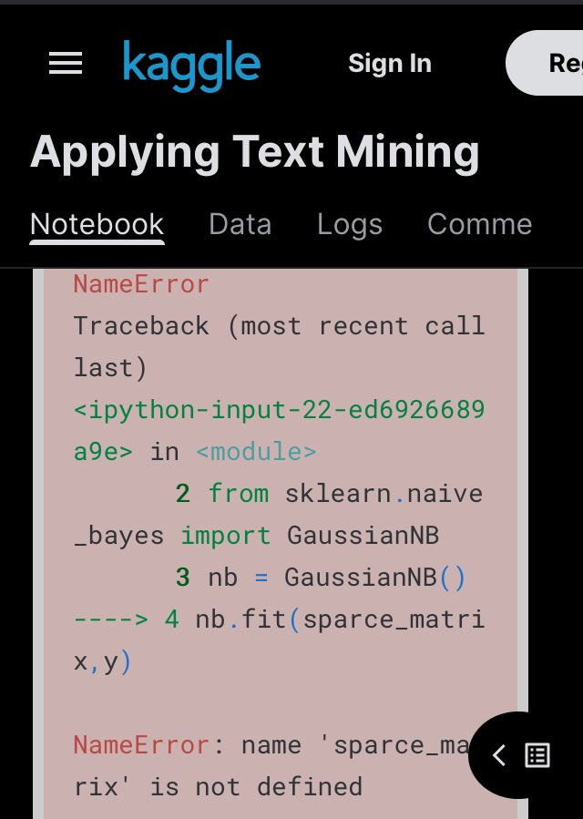

This idea based on [shitty sentiment analysis](https://twitter.com/ImZackAdams/status/1526378770277576704)

Let me repeat it here:

> run last 500 tweets through shitty sentiment analysis and give a score between -1 (negative) and 1(positive)

I also want to generate a special pretty badge that you can post to Twitter that will display a special trait like 😇 or 😈

## Sentiment analysis of the tweets dataset

Some threads collect thousands likes, but seems like no one really going through the links. For example [this kaggle](https://www.kaggle.com/code/kanncaa1/applying-text-mining/notebook) about text mining slowly going with string manipulation and regexes, but interesting classification at the end fails because some names are not defined 😖

Nevertheless it uses very interesting dataset. Guys from CrowdFlower decided to gues gender by text we write. Amazing, right?

> CrowdFlower team: to run a text mining experiment we pulled 20,000 tweets with the word “the” and the word “and”.
>
> me: Why?
>
> CrowdFlower team:
> 
<iframe src="https://giphy.com/embed/8GclDP2l4qbx6" width="100%" height="100%" style="position:absolute" frameBorder="0" class="giphy-embed" allowFullScreen></iframe>

<a href="https://giphy.com/gifs/lol-gif-shrugging-shrug-8GclDP2l4qbx6">via GIPHY</a>
