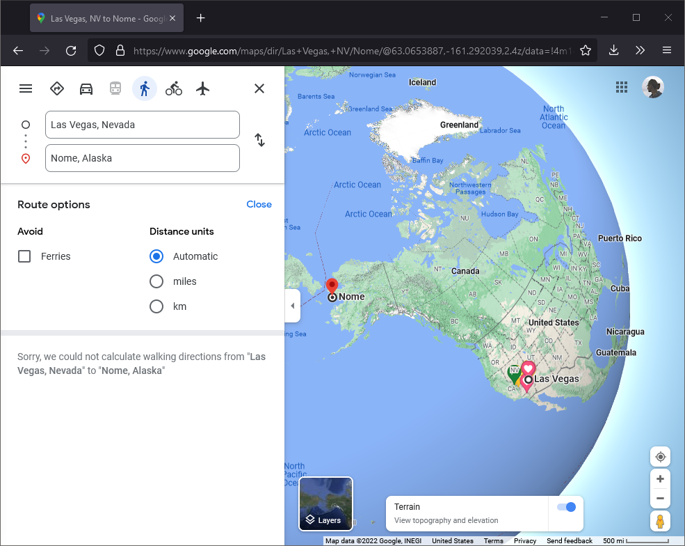

## Rome to Rio

Google Maps not always offer you a route with mixed type of transportation, but this website is not hesitating to mix and match ship, bus, car, and airplane. 

[https://www.rome2rio.com/](https://www.rome2rio.com/)

## Marine traffic

You might be heard about Fly Radar where all aircrafts are depicted on the map in real time. But did you know that similar thing does exist for ships?

[https://www.marinetraffic.com/en/ais/home/centerx:-12.0/centery:25.0/zoom:4](https://www.marinetraffic.com/en/ais/home/centerx:-12.0/centery:25.0/zoom:4)

## Walk around the world

Ask google maps how long does it take to walk around the world. I cannot proceed even with the first interval. 

We need better tools.

